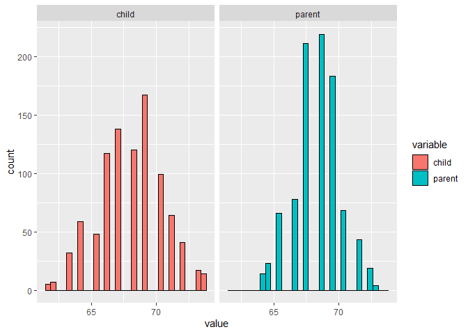

`Week 1` Regression Models
================

-   👨🏻‍💻 Author: Anderson H Uyekita
-   📚 Specialization: <a
    href="https://www.coursera.org/specializations/data-science-foundations-r"
    target="_blank" rel="noopener">Data Science: Foundations using R
    Specialization</a>
-   📖 Course:
    <a href="https://www.coursera.org/learn/regression-models"
    target="_blank" rel="noopener">Regression Models</a>
    -   🧑‍🏫 Instructor: Brian Caffo
-   📆 Week 1
    -   🚦 Start: Tuesday, 05 July 2022
    -   🏁 Finish: Wednesday, 06 July 2022

------------------------------------------------------------------------

#### Assignments & Deliverables

-   [🚀 Course Project 1
    Repository](https://github.com/AndersonUyekita/regression-models_course-project-1)
-   [📝 Quiz 1](./quiz-1_regression-models.md)

#### Slides

-   Module 1 – Least Squares and Linear Regression
    -   01_01 Introduction
    -   01_02 Notation
    -   01_03 Ordinary least squares
    -   01_04 Regression to the mean
    -   01_05 Linear regression
    -   01_06 Residuals
    -   01_07 Regression inference

#### Description

> This week, we focus on least squares and linear regression.

------------------------------------------------------------------------

## Class Notes

### Regression

> Regression models are the workhorse of data science. They are the most
> well described, practical and theoretically understood models in
> statistics. A data scientist well versed in regression models will be
> able to solve an incredible array of problems.
>
> Perhaps the key insight for regression models is that they produce
> highly interpretable model fits. This is unlike machine learning
> algorithms, which often **sacrifice interpretability** for **improved
> prediction performance or automation**. These are, of course, valuable
> attributes in their own rights. However, the benefit of simplicity,
> **parsimony and interpretability** offered by regression models (and
> their close generalizations) should make them a first tool of choice
> for any practical problem.

> A ball hog is a derisive term for a basketball player who handles the
> ball exclusively to the point of impairing the team. Despite not being
> a violation of the rules of basketball, “ball-hogging” is generally
> considered unacceptable playing behavior at all levels of basketball
> competition. – [Wikipedia](https://en.wikipedia.org/wiki/Ball_hog)

**Summary**

> -   Prediction e.g.: to use the parent’s heights to predict children’s
>     heights.
> -   Modeling e.g.: to try to find a parsimonious, easily described
>     mean relationship between parental and child heights.
> -   Covariation e.g.: to investigate the variation in child heights
>     that appears unrelated to parental heights (residual variation)
>     and to quantify what impact genotype information has beyond
>     parental height in explaining child height.

#### Defining the middle

``` r
# Loading the UsingR package
library(UsingR)

# Loading the Galton dataset to environment.
data("galton")

# Plotting the data.
ggplot(data = reshape::melt(galton), aes(x = value, fill = variable)) + 
    geom_histogram(colour = 'black', bindwidth = 1) + 
    facet_grid(. ~ variable)
```

<!-- -->

The middle is a given

which minimizes the summation:

^2")

-   This is physical center of mass of the histogram.

^2")

Where

-   :
    Mean of
    

> **Minimizing the average (or sum of the)** squared errors seems like a
> reasonable strategy, though of course there are others.

Strategy is minimize the Error Summation:

^2")

or the Average of error:

^2}{n}")

The Average will be the Error Summation divided by n, which is a
constant. So it will not change the minimization results.

#### Regression through the origin

Considering a line crossing the origin and minimizing the squared error.

^2}")

-   Generally is it a bad practice.

#### Centering Data

This procedure moves the origin (0,0) to be on the mass center of the
data. So doing it, the intercept should be zero.

Explaining the `lm` function:

}_{\text{centering in y-axis}}) \sim I(\underbrace{parent - mean(parent)}_{\text{centering in x-axis}}) \underbrace{- 1}_{\text{get rid of the intercept}})")

The `I()` means “as is”, so the `child - mean(child)` will be evaluate
as is.

``` r
# Regression through the origin.
lm(data = galton, I(child - mean(child)) ~ I(parent - mean(parent)) - 1)
```

    ## 
    ## Call:
    ## lm(formula = I(child - mean(child)) ~ I(parent - mean(parent)) - 
    ##     1, data = galton)
    ## 
    ## Coefficients:
    ## I(parent - mean(parent))  
    ##                   0.6463

The coefficient is related to a linear regression centered at the mass
center of the dataset.

#### Regression with intercept

> **Ordinary least squares** (OLS) is the workhorse of statistics. It
> gives a way of taking complicated outcomes and explaining behavior
> (such as trends) using linearity. The simplest application of OLS is
> fitting a line through some data. In the next few lectures, we cover
> the basics of linear least squares.

Possible function which explains the child’s Height.


I want to minimize:

\Big)^2 }")

``` r
# Assign the values to variables y and x.
y <- galton$child
x <- galton$parent

# Calculating the theoretical values.
beta1 <- cor(y,x) * sd(y)/sd(x)
beta0 <- mean(y) - beta1 * mean(x)

# Printing.
beta0; beta1;
```

    ## [1] 23.94153

    ## [1] 0.6462906

As you can see, the slope
()
is equal to the centered data!! Centering the data have just shifted the
data and has changed only the intercept.

Now, using the `lm` function **with** intercept.

``` r
# Calculating the coefficients with intercept.
lm(y ~ x)
```

    ## 
    ## Call:
    ## lm(formula = y ~ x)
    ## 
    ## Coefficients:
    ## (Intercept)            x  
    ##     23.9415       0.6463

#### Regression to the mean

> Here is a fundamental question. Why is it that the children of tall
> parents tend to be tall, but not as tall as their parents? Why do
> children of short parents tend to be short, but not as short as their
> parents? Conversely, why do parents of very short children, tend to be
> short, but not a short as their child? And the same with parents of
> very tall children?
>
> We can try this with anything that is measured with error. Why do the
> best performing athletes this year tend to do a little worse the
> following? Why do the best performers on hard exams always do a little
> worse on the next hard exam?
>
> These phenomena are all examples of so-called regression to the mean.
> Regression to the mean, was invented by Francis Galton in the paper
> “Regression towards mediocrity in hereditary stature” The Journal of
> the Anthropological Institute of Great Britain and Ireland , Vol. 15,
> (1886). The idea served as a foundation for the discovery of linear
> regression.
