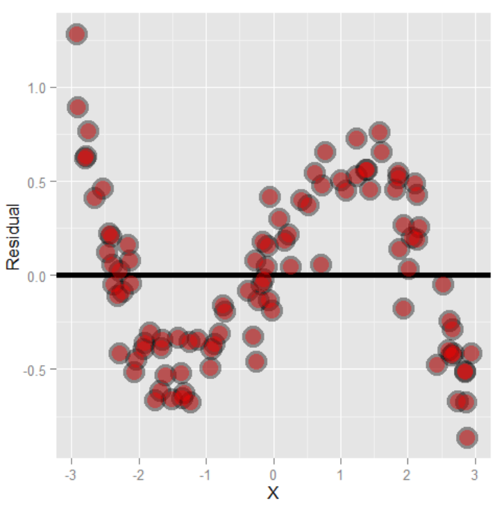

`Week 2` Regression Models
================

-   👨🏻‍💻 Author: Anderson H Uyekita
-   📚 Specialization: <a
    href="https://www.coursera.org/specializations/data-science-statistics-machine-learning"
    target="_blank" rel="noopener">Data Science: Statistics and Machine
    Learning Specialization</a>
-   📖 Course:
    <a href="https://www.coursera.org/learn/regression-models"
    target="_blank" rel="noopener">Regression Models</a>
    -   🧑‍🏫 Instructor: Brian Caffo
-   📆 Week 2
    -   🚦 Start: Tuesday, 05 July 2022
    -   🏁 Finish: Monday, 18 July 2022

------------------------------------------------------------------------

#### Assignments & Deliverables

-   [🚀 Course Project 2
    Repository](https://github.com/AndersonUyekita/regression-models_course-project-2)
-   [📝 Quiz 2](./quiz-2_regression-models.md)

#### Slides

-   Module 2 – Linear Regression & Multivariable Regression
    -   02_01 Multivariate regression
    -   02_02 Multivariate examples
    -   02_03 Adjustment
    -   02_04 Residual variation and diagnostics
    -   02_05 Multiple variables

#### Description

> This week, we will work through the remainder of linear regression and
> then turn to the first part of multivariable regression.

------------------------------------------------------------------------

## Class Notes

#### Statistical linear regression models

> Up to this point, we’ve only considered estimation. Estimation is
> useful, but we also need to know **how to extend our estimates to a
> population**. This is the process of statistical inference. Our
> approach to statistical inference will be through a statistical model.
> At the bare minimum, we need a few distributional assumptions on the
> errors. However, we’ll focus on full model assumptions under
> Gaussianity.

For this lecture we are going to use the `diamond` dataset from `UsingR`
package.

##### Case 1 – Without Centering Data

``` r
# Loading Diamond dataset in Environment.
data("diamond")

# Printing the structure
str(diamond)
```

    ## 'data.frame':    48 obs. of  2 variables:
    ##  $ carat: num  0.17 0.16 0.17 0.18 0.25 0.16 0.15 0.19 0.21 0.15 ...
    ##  $ price: int  355 328 350 325 642 342 322 485 483 323 ...

Now that we know the variables’ names let’s create a linear regression
to explain the price (in SIN units – Singapore Dollar) by the diamond
carats.

``` r
# Calculating the linear regression with intercept.
#
# lm(formula = 'What we want to explain' ~ 'What we think is a good estimator' )
#
# If we do not want intercept just add -1
#
# lm(formula = 'What we want to explain' ~ 'What we think is a good estimator' - 1 ) # With no intercept
#
fit <- lm(data = diamond, formula = price ~ carat)

# Printing results.
fit$coefficients
```

    ## (Intercept)       carat 
    ##   -259.6259   3721.0249

**Explanation/Interpretation**

> We estimate an expected 3721.02 SIN dollar increase in price for every
> carat increase in mass of diamond, and. The intercept negative 259.63
> means the expected price of a 0 carat diamond is 259.63 (!!!!).

**WARNING**

Although we have **Rejected**
,
it is hard to believe in paying 259.63 SIN for a diamond with 0 carats.
It is not possible to explain it.

##### Case 2 – Centering Data

At this time, we are “centering” the dataset on creating an
interpretable model. We only need to center the carat variable.

``` r
# We do not have problem with price variable.
price <- diamond$price

# Centering carat variable.
carat_c <- diamond$carat - mean(diamond$carat)

# Fitting a new linear model
fit2 <- lm(formula = price ~ carat_c, data = data.frame("prince" = price, "carat_c" = carat_c))

# Printing the coefficients
summary(fit2)$coeff
```

    ##              Estimate Std. Error   t value     Pr(>|t|)
    ## (Intercept)  500.0833   4.595784 108.81351 3.857422e-57
    ## carat_c     3721.0249  81.785880  45.49715 6.751260e-40

We have centered the carat; the Intercept has changed to a positive
number.

**Explanation/Interpretation**

> -   Notice the estimated slope didn’t change at all.
> -   Thus 500.1 SIN is the expected price for the average sized diamond
>     of the data (0.2042 carats).

##### Predicting based on a fitted model

**Using model `fit`**

``` r
# Sample of 3 diamonds with x carats.
newx <- c(0.16, 0.27, 0.34)

# Calculating using predict.
predict(fit, newdata = data.frame(carat = newx))
```

    ##         1         2         3 
    ##  335.7381  745.0508 1005.5225

**Using model `fit2`**

``` r
# Centering the carat new sample.
newx2 <- c(0.16, 0.27, 0.34) - mean(diamond$carat)

# Calculating "manually".
fit2$coefficients[1] + fit2$coefficients[2]*newx2
```

    ## [1]  335.7381  745.0508 1005.5225

Now using `predict()`.

``` r
predict(fit2, newdata = data.frame(carat_c = newx2))
```

    ##         1         2         3 
    ##  335.7381  745.0508 1005.5225

It is important to keep the `newdata` column name in accordance with the
`data` used in `lm()`.

#### Residuals

> **Residuals represent variation left unexplained by our model.** We
> emphasize the difference between residuals and errors. The errors
> unobservable true errors from the known coefficients, while residuals
> are the observable errors from the estimated coefficients. In a sense,
> the residuals are estimates of the errors.

My model:


Where:

-   
    is the error in
    
    observation.

Assuming the notation

to the predicted value to

observation.


So
").

##### Example calculating residual

Let’s use the `diamond` dataset.

``` r
# loading diamond dataset.
data(diamond)

# Assing prince to y; carat to x and creating variable n as number of observations.
y <- diamond$price; x <- diamond$carat; n <- length(y)

# Fitting a model with intercept.
fit <- lm(y ~ x)
```

The residual is calculated using `resid()`.

``` r
## The easiest way to get the residuals
e <- resid(fit)

# Printing the residual
e
```

    ##           1           2           3           4           5           6 
    ## -17.9483176  -7.7380691 -22.9483176 -85.1585661 -28.6303057   6.2619309 
    ##           7           8           9          10          11          12 
    ##  23.4721795  37.6311854 -38.7893116  24.4721795  51.8414339  40.7389488 
    ##          13          14          15          16          17          18 
    ##   0.2619309  13.4209369  -1.2098087  40.5287002  36.1029250 -44.8405542 
    ##          19          20          21          22          23          24 
    ##  79.3696943 -25.0508027  57.8414339   9.2619309 -20.9483176  -3.7380691 
    ##          25          26          27          28          29          30 
    ## -19.9483176  27.8414339 -54.9483176   8.8414339 -26.9483176  16.4721795 
    ##          31          32          33          34          35          36 
    ## -22.9483176 -13.1020453 -12.1020453  -0.5278205   3.2619309   2.2619309 
    ##          37          38          39          40          41          42 
    ##  -1.2098087 -43.2098087 -27.9483176 -23.3122938 -15.6303057  43.2672091 
    ##          43          44          45          46          47          48 
    ##  32.8414339   7.3696943   4.3696943 -11.5278205 -14.8405542  17.4721795

Or manually calculating:

``` r
## Obtain the residuals manually, get the predicted Ys first
yhat <- predict(fit)

## Printing the residual
y - yhat
```

    ##           1           2           3           4           5           6 
    ## -17.9483176  -7.7380691 -22.9483176 -85.1585661 -28.6303057   6.2619309 
    ##           7           8           9          10          11          12 
    ##  23.4721795  37.6311854 -38.7893116  24.4721795  51.8414339  40.7389488 
    ##          13          14          15          16          17          18 
    ##   0.2619309  13.4209369  -1.2098087  40.5287002  36.1029250 -44.8405542 
    ##          19          20          21          22          23          24 
    ##  79.3696943 -25.0508027  57.8414339   9.2619309 -20.9483176  -3.7380691 
    ##          25          26          27          28          29          30 
    ## -19.9483176  27.8414339 -54.9483176   8.8414339 -26.9483176  16.4721795 
    ##          31          32          33          34          35          36 
    ## -22.9483176 -13.1020453 -12.1020453  -0.5278205   3.2619309   2.2619309 
    ##          37          38          39          40          41          42 
    ##  -1.2098087 -43.2098087 -27.9483176 -23.3122938 -15.6303057  43.2672091 
    ##          43          44          45          46          47          48 
    ##  32.8414339   7.3696943   4.3696943 -11.5278205 -14.8405542  17.4721795

There is “no” difference using built-in function `redis()` or manually.

``` r
# Comparisson
e - (y - yhat)
```

    ##             1             2             3             4             5 
    ## -9.485746e-13 -2.877698e-13 -1.030287e-13 -1.136868e-13 -1.776357e-14 
    ##             6             7             8             9            10 
    ## -1.101341e-13 -1.136868e-13 -1.136868e-13 -1.421085e-14 -1.136868e-13 
    ##            11            12            13            14            15 
    ## -1.065814e-13  5.684342e-14 -1.096900e-13 -1.225686e-13 -3.375078e-14 
    ##            16            17            18            19            20 
    ## -1.065814e-13 -1.634248e-13 -4.263256e-14 -1.421085e-14 -6.039613e-14 
    ##            21            22            23            24            25 
    ## -1.065814e-13 -1.101341e-13 -1.030287e-13 -1.096900e-13 -1.030287e-13 
    ##            26            27            28            29            30 
    ## -1.101341e-13 -9.947598e-14 -1.101341e-13 -1.030287e-13 -1.136868e-13 
    ##            31            32            33            34            35 
    ## -1.030287e-13 -3.019807e-14 -3.019807e-14 -1.163514e-13 -1.096900e-13 
    ##            36            37            38            39            40 
    ## -1.096900e-13 -3.375078e-14 -3.552714e-14 -1.030287e-13 -7.815970e-14 
    ##            41            42            43            44            45 
    ## -2.131628e-14  4.973799e-14 -1.065814e-13 -2.131628e-14 -1.953993e-14 
    ##            46            47            48 
    ## -1.172396e-13 -4.263256e-14 -1.136868e-13

**There are a small difference.**

##### Plotting the residual

Using the residual calculated in the diamond dataset.

``` r
# Plotting a ggplot
ggplot(data = diamond, aes(x = carat, y = e)) + 
    geom_point() + 
    xlab("Carat") + 
    ylab("Residual (SIN)")
```

<!-- -->

For the plot above, there may be no trend or pattern. Therefore, we
classify the residual as a homogeneous spread on the graph, the
so-called homoscedastic.

##### Heterocedastic Residual

Figure 1 shows a heteroscedastic residual, meaning the fit model is not
designed correctly.


In the Figure 2 case, the residual has a sinusoidal format, which we
could understand that we have modeled only the linear part and left
valuable info in the residual. So the residuals are not white noise and
must be adjusted to extract this sinusoidal part.



##### Residual Variance

Residual Variance is the
.

``` r
# Modeling
fit <- lm(data = diamond, price ~ carat)

# Printing the sigma from summary
summary(fit)$sigma
```

    ## [1] 31.84052

It is also possible calculate it manually.

``` r
# For small sample the -2 make difference.
sqrt(sum(resid(fit)^2)/(length(diamond$carat) - 2))
```

    ## [1] 31.84052

##### R2

From the total variability in price
(`resid(lm(data = diamond, price ~ 1))`), how much residual variability
I can explain when I use one variable to explain it, in this case, carat
(`resid(lm(data = diamond, price ~ carat))`).

Manually the

is calculated:

``` r
# Calculating the total variability.
e_total <- resid(lm(data = diamond, price ~ 1))

# Calculating the residual variability after fitting
e_lm <- resid(lm(data = diamond, price ~ carat))

# Calculating the R2
(sum(e_total^2) - sum(e_lm^2))/sum(e_total^2)
```

    ## [1] 0.9782608

Calculating using the `summary()`.

``` r
# Printing the R2.
summary(lm(data = diamond, price ~ carat))$r.squared
```

    ## [1] 0.9782608


Where

^2}")

``` r
# Calculating the Regression variability
sum(e_total^2) - sum(e_lm^2)
```

    ## [1] 2098596

#### Inference in regression

> Inference is the process of drawing conclusions about a population
> using a sample. In statistical inference, we must account for the
> uncertainty in our estimates in a principled way. Hypothesis tests and
> confidence intervals are among the most common forms of statistical
> inference.
>
> These statements apply generally, and, of course, to the regression
> setting that we’ve been studying. In the next few lectures, we’ll
> cover inference in regression where we make some Gaussian assumptions
> about the errors.

According to:


We have the properties:

> -   They are normally distributed and have a finite sample Student’s T
>     distribution under normality assumptions.
> -   They can be used to test:
>     -   
>         and
>         
> -   They can be used to create a confidence interval
>     
>     via
>     
>     where
>     
>     is the relevant quantile from either a normal or T distribution.

Let’s calculate the fit model.

``` r
# calculating the fit model.
fit <- lm(data = diamond, price ~ carat)

# Calculating the summary
fit_summary <- summary(fit)

# Printing the coefficients.
fit_summary$coefficients
```

    ##              Estimate Std. Error   t value     Pr(>|t|)
    ## (Intercept) -259.6259   17.31886 -14.99094 2.523271e-19
    ## carat       3721.0249   81.78588  45.49715 6.751260e-40

> Remember, we reject if our P-value is less than our desired type I
> error rate.

For this example, the p-value is very low (less then
),
so we **Reject**
,
which means there is a linear relation. However, if we **Failed to
Reject**
,
so there is no linear relation, because the **slope is zero**.

Concerning the intercept, there is the same understanding. If we Reject
the
,
there is an intercept different from zero. Although, if we **Failed to
Reject**
,
the intercept is zero.

Now we have all values it is possible to calculate the Confidence
Interval.


Calculating in R.

``` r
# Intercept
fit_summary$coefficients[1,1] + c(-1, 1) * qt(p = (1 - 0.05/2), df = fit$df) * fit_summary$coefficients[1,2];
```

    ## [1] -294.4870 -224.7649

``` r
# Slope
fit_summary$coefficients[2,1] + c(-1, 1) * qt(p = (1 - 0.05/2), df = fit$df) * fit_summary$coefficients[2,2]
```

    ## [1] 3556.398 3885.651

> So, we would interpret this as: “with 95% confidence, we estimate that
> a 1 carat increase in diamond size results in a 3556.4 to 3885.6
> increase in price in (Singapore) dollars”

##### Prediction

``` r
library(ggplot2)

fit <- lm(formula = price ~ carat, data = diamond)

newx <- data.frame("carat" = seq(min(x), max(x), length = 100))
p1 <- data.frame(predict(fit, newdata = newx, interval = ("confidence")))
p2 <- data.frame(predict(fit, newdata = newx, interval = ("prediction")))
p1$interval <- "confidence"
p2$interval <- "prediction"
p1$x <- newx$carat
p2$x <- newx$carat
dat <- rbind(p1, p2)
names(dat)[1] = "y"

g <- ggplot(dat, aes(x = x, y = y))
g <- g + geom_ribbon(aes(ymin = lwr, ymax = upr, fill = interval), alpha = 0.2)
g <- g + geom_line()
g <- g + geom_point(data = data.frame(x = x, y=y), aes(x = x, y = y), size = 4)
g
```

<!-- -->
