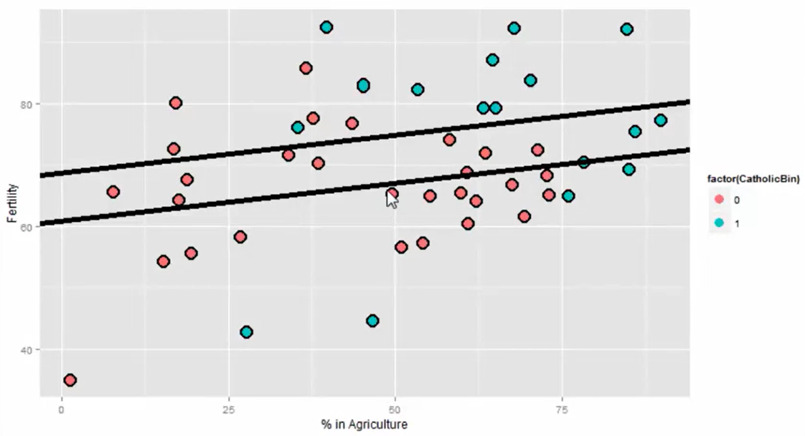
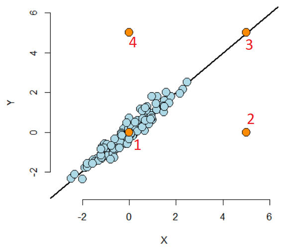

```{r setup,include=FALSE}
knitr::opts_chunk$set(echo = TRUE, cache = TRUE, message = FALSE, warning = FALSE)
library(rmarkdown)
library(lubridate)
library(tidyverse)
library(ggplot2)
library(magrittr)
library(datasets)
library(UsingR)
library(GGally)
```

`r if(!knitr::is_html_output()) {sprintf(fmt = "* &#x1f468;&#x1F3FB;&#x200d;&#x1f4bb; Author: %s", params$author)}`
`r sprintf(fmt = "* &#x1f4da; Specialization: [%s](%s){target='_blank' rel='noopener'}", params$specialization, params$specialization_url)`
`r sprintf(fmt = "* &#x1f4d6; Course: [%s](%s){target='_blank' rel='noopener'}", params$course, params$course_url)`
    `r sprintf(fmt = "* &#x1F9D1;&#x200d;&#x1F3EB; Instructor: %s", params$instructor)`
`r sprintf(fmt = "* &#x1F4C6; %s", params$week)`
    `r sprintf(fmt = "* &#x1F6A6; Start: %s", format(params$course_start, "%A, %d %B %Y"))`
    `r sprintf(fmt = "* &#x1F3C1; Finish: %s", format(params$course_finish, "%A, %d %B %Y"))`

--------------------------------------------------------------------------------

#### Assignments & Deliverables

* [&#x1F680; Course Project 3 Repository](https://github.com/AndersonUyekita/regression-models_course-project-3)
* [&#x1F4DD; Quiz 3](./quiz-3_regression-models.md)

#### Slides

* Module 3 -- Multivariable Regression, Residuals, & Diagnostics
    * 03_01 GLMs
    * 03_02 Binary outcomes
    * 03_03 Count outcomes
    * 03_04 Olio

#### Description

> This week, we'll build on last week's introduction to multivariable regression with some examples and then cover residuals, diagnostics, variance inflation, and model comparison.

--------------------------------------------------------------------------------

## Class Notes

#### Multivariable regression

>We now extend linear regression so that our models can contain more variables. A natural first approach is to assume additive effects, basically extending our line to a plane, or generalized version of a plane as we add more variables.  Multivariable regression represents one of the most widely used and successful methods in statistics.  

> The interpretation of a multivariate regression coefficient is the expected change in the
response per unit change in the regressor, holding all of the other regressors fixed.

##### Example

Multivariate using `Seatbelts` dataset.

```{r}
# Loading Seatbelts dataset
library(datasets)

# Creating a object.
df <- as_tibble(datasets::Seatbelts)

# Fitting the model
fit <- lm(data = df, formula = DriversKilled ~ kms + PetrolPrice)

# Printing the coefficients results.
round(summary(fit)$coeff, 4)
```

All parameters have **rejected** the $H_0$ hypothesis. However, it lacks interpretation because the expected number of 215 drivers killed when the `kms` and `PetroPrice` are equal to zero has no sense.

##### Adjusting the data

Creating a meaningful model.

```{r}
# Loading Seatbelts dataset
library(datasets)

# Creating a object.
df <- as_tibble(datasets::Seatbelts)

# Centering the dataset.
df$kms_avg <- df$kms - mean(df$kms)
df$petrol_avg <- (df$PetrolPrice - mean(df$PetrolPrice))/sd(df$PetrolPrice)

# Adding new variables to the dataset.
kms_avg <- mean(df$kms)
petrol_avg <- mean(df$PetrolPrice)

# Fitting the model
fit <- lm(data = df, formula = DriversKilled ~ kms_avg + petrol_avg)

# Printing the coefficients results.
summary(fit)$coeff
```

* The intercept of 122.8 is the estimated number of `DriversKilled` for the average `PetroPrice` and average `kms`;
* The `PetroPrice` negative 7.9 means we expect less 7.9 `DriversKilled` per **one standard deviation** change in `PetroPrice`, and;
* Maintaining the other variables constant, the negative 0.017 in average `kms` means we expect less 0.0017 `DriversKilled` per `kms`, It is counter intuitive because increasing the `kms` reduces the drivers killed.

It is also possible to scale `kms` to analyze it in thousands.

```{r}
# Loading Seatbelts dataset
library(datasets)

# Creating a object.
df <- as_tibble(datasets::Seatbelts)

# Centering the dataset.
df$kms_avg <- (df$kms - mean(df$kms))/1000
df$petrol_avg <- (df$PetrolPrice - mean(df$PetrolPrice))/sd(df$PetrolPrice)

# Adding new variables to the dataset.
kms_avg <- mean(df$kms)
petrol_avg <- mean(df$PetrolPrice)

# Fitting the model
fit <- lm(data = df, formula = DriversKilled ~ kms_avg + petrol_avg)

# Printing the coefficients results.
summary(fit)$coeff
```
* After the scaling, we expect less 1.75 `DriversKilled` per 1000 `kms`.

#### Multivariable regression tips and tricks

This lecture will use the `swiss` dataset from the `datasets` package.

```{r}
# Loading the dataset to environment.
swiss <- datasets::swiss
```

Let's examine this dataset a bit.

>**Description**
>
>Standardized fertility measure and socio-economic indicators for each of 47 French-speaking provinces of Switzerland at about 1888.
>
>**Format**
>
>A data frame with 47 observations on 6 variables, each of which is in percent, i.e., in [0, 100].
>
>[,1] Fertility $I_g$, ‘common standardized fertility measure’
>[,2] Agriculture % of males involved in agriculture as occupation
>[,3] Examination % draftees receiving highest mark on army examination
>[,4] Education % education beyond primary school for draftees.
>[,5] Catholic % ‘catholic’ (as opposed to ‘protestant’).
>[,6] Infant.Mortality live births who live less than 1 year.
>
>All variables but ‘Fertility’ give proportions of the population.
>
>**Details**
>
>(paraphrasing Mosteller and Tukey):
>
>Switzerland, in 1888, was entering a period known as the demographic transition; i.e., its fertility was beginning to fall from the high level typical of underdeveloped countries.
>
>The data collected are for 47 French-speaking “provinces” at about 1888.
>
>Here, all variables are scaled to [0, 100], where in the original, all but "Catholic" were scaled to [0, 1].

Based on the `help()` function, we need to confirm the range of the values. It should be 0 to 100 except for `Fertility`, which is standardized.

```{r}
# Checking the structure.
str(swiss)
```

A `summary()` will give us the presence of `NA` observation and some descriptive analysis.

```{r}
# Printing the summary.
summary(swiss)
```

Finally, the `ggpairs()` create several plots to explore it visually.

```{r}
# Creating a quick exploratory.
ggpairs(data = swiss, lower = list(continuous = "smooth"))
```

Now, let's create a fit model.

```{r}
# creating a multivariate model WITH Intercept.
#
# The dot means = all other variables
#
fit <- lm(data = swiss, formula = Fertility ~ .)

# Printing the coefficients from summary
round(summary(fit)$coeff, 4)
```

**Obs.:** The Fertility is a standardized variable.

Table 1 shows the interpretation process.

<center><strong>Table 1</strong> -- Variable Interpretation</center>
|      Variable     | Manipulation | Interpretation                                      |
|:-----------------:|:------------:|:----------------------------------------------------|
| Agriculture       |  scaled [%]  | Our model estimates an expected 0.17 decrease in standardized fertility for every 1% increase in percentage of males involved in `Agriculture`, holding the remaining variables constant. |
| Examination       |  scaled [%]  | Our model estimates an expected 0.25 decrease in standardized fertility for every 1% increase in percentage of males involved in `Examination`, holding the remaining variables constant. |
| Education         |  scaled [%]  | Our model estimates an expected 0.87 decrease in standardized fertility for every 1% increase in percentage of males involved in `Education`, holding the remaining variables constant. |
| Catholic          |  scaled [%]  | Our model estimates an expected 0.10 increase in standardized fertility for every 1% increase in percentage of males involved in `Catholic`, holding the remaining variables constant. |
| Infant.Mortality  |   ???   | ??? |

Analyzing the t-test.

$$H_0 : \beta_{agriculture}=0$$
$$H_1 : \beta_{agriculture} \ne 0$$

Due to the $P( > \vert t \vert )$ is 0.0187 or 1.87%, we **Reject** the $H_0$ because the $\alpha$ is 5%.

$$P( > \vert t \vert ) < 5\%$$

For this reason, there is evidence `Agriculture` is a good predictor.

```{r}
summary(fit)
```

```{r}
# Calculating the p-value - AGRICULTURE
2*pt(q = -2.4481, df = 41, lower.tail = TRUE)
```

```{r}
# Calculating the p-value - EXAMINATION
2*pt(-1.0163, df = 41, lower.tail = TRUE)
```

```{r}
# Calculating the p-value - EDUCATION
2*pt(-4.7585, df = 41, lower.tail = TRUE)
```

```{r}
# Calculating the p-value - CATHOLIC
2*pt(2.9530, df = 41, lower.tail = FALSE)
```

```{r}
# Calculating the p-value - Infant.Mortality
2*pt(2.8216, df = 41, lower.tail = FALSE)
```

##### Unnecessary Variable

Case one variable is a linear combination of one or more variables, the `lm()` will eliminate the variable.

> It is only through adding variables that are not perfectly explained by the existing ones that one can explain more variation in the response.

##### Dummy Variables

> It is interesting to note that models with factor variables as predictors are simply special cases of regression models. 

* Three level factors: Republican, Democrat, and Independent.

$$Y_i = \beta_0 + X_{i1} \cdot \beta_1 + X_{i2} \cdot \beta_2 + \epsilon_i$$

As you can see, only two variables must codify those three parties.

|$X_{i1}$|$X_{i2}$|Explanation|
|:-:|:-:|:-:|
|1|0|Republican|
|0|1|Democrat|
|0|0|Independent|

The `Independent` party could be codified as a combination of the other variables.

> So, we can interpret our coefficients as follows:
>
> * $\beta_1$ compares the mean for Republicans to that of Independents/Others.
>     * The mean: $E[Y_i] = \beta_0 + \beta_1$
> * $\beta_2$ compares the mean for Democrats to that of Independents/Others.
>     * The mean: $E[Y_i] = \beta_0 + \beta_2$
> * $\beta_1 - \beta_2$ compares the mean for Republicans to that of Democrats.
>     * The mean: $E[Y_i] = \beta_0$
>
> Notice the coefficients are all comparisons to the category that we left out, Independents/Others.
>
> **If one category is an obvious reference category, chose that one to leave out.**
> In R, if our variable is a factor variable, it will create the dummy variables for us and pick one of the levels to be the reference level. Let’s go through an example to see.

##### Example with Intercept

```{r}
# Loading InsectSprays dataset.
data(InsectSprays)
```

> **Description**
>
> The counts of insects in agricultural experimental units treated with different insecticides.
>
> **Format**
>
> A data frame with 72 observations on 2 variables.
>
>[,1] count - numeric - Insect count
>[,2] spray - factor - The type of spray

`spray` is a factor variable.

```{r}
str(InsectSprays)
```

`spray` has 6 levels.

```{r}
summary(InsectSprays)
```

Data visualization

```{r}
# Plotting a graph.
g = ggplot(data = InsectSprays, aes(y = count, x = spray, fill = spray))
g = g + geom_violin(colour = "transparent")
g = g + geom_dotplot(binaxis = "y", stackdir = "center", binwidth = 0.5)
g = g + xlab("Type of spray") + ylab("Insect count")
g
```

Fitting a model with dummies and Intercept.

```{r}
# Fitting a multivariate model.
fit <- lm(data = InsectSprays, formula = count ~ spray)

# Printing the coefficients in summary
summary(fit)$coef
```
The `lm()` function has used `sprayA` as the reference category (the default, since it has the lowest alphanumeric factor level).

**Interpretation**

> * The test in the intercept is mean of Spray A is zero?
> * (????) The other test will be related to the Mean of Spray B is equal to Mean of Spray A (????).
> * Comparing `Spray B` to `Spray A` (as `B - A`) the compared mean is 0.8333.
> * Comparing `Spray C` to `Spray A` (as `C - A`) the compared mean is -12.4166.
> * The inferential statistics: standard errors, t value and P-value all correspond to those comparisons.
> * The intercept, 14.5, is the mean for Spray A. So, its inferential statistics are testing whether or not the mean for Spray A is zero. 
> * As is often the case, this test isn’t terribly informative and often yields extremely small statistics (since we know the spray kills some bugs).
> * The estimated mean for Spray B is its effect plus the intercept (14.5 + 0.8333);
> * The estimated mean for Spray C is 14.5 - 12.4167 (its effect plus the intercept)

##### Example without Intercept

```{r}
# Fitting a multivariate model.
fit <- lm(data = InsectSprays, formula = count ~ spray - 1)

# Printing the coefficients in summary
summary(fit)$coef
```

**Interpretation**

* 14.50 is the mean for Spray A
* 15.33 is the mean for Spray B (is confirmed by the last example 14.5 + 0.8333)
* 2.083 is the mean for Spray C
* This is a nice trick if you want your model formulated in the terms of the group means, rather than the group comparisons relative to the reference group.
* Also, if there are no other covariates, the estimated coefficients for this model are exactly the empirical means of the groups.

```{r}
# Calculating the mean.
InsectSprays %>%
    group_by(spray) %>%
    summarise(avg = mean(count))
```

##### Relevel the Categories

It is necessary if you want to use `Spray C` as reference.

```{r}
spray2 <- relevel(InsectSprays$spray, "C")

summary(lm(count ~ spray2, data = InsectSprays))$coef
```

##### Summary

> * If we treat a variable as a factor, R includes an intercept and omits the alphabetically first level of the factor.
>     * The intercept is the estimated mean for the reference level.
>     * The intercept t-test tests for whether or not the mean for the reference level is 0.
>     * All other t-tests are for comparisons of the other levels versus the reference level.
>     * Other group means are obtained the intercept plus their coefficient.
> * If we omit an intercept, then it includes terms for all levels of the factor.
>     * Group means are now the coefficients.
>     * Tests are tests of whether the groups are different than zero.
> * If we want comparisons between two levels, neither of which is the reference level, we could refit the model with one of them as the reference level.

#### Swiss Dataset with Dummy

This time we will analyze this dataset, adding a new categorical variable, the so-called Dummy Variable.

For cities with Catholic, greater than 50% will be defined as 1.

```{r}
# Loading the Swiss dataset.
df_swiss <- datasets::swiss

# Adding a the new variable.
df_swiss <- mutate(.data = df_swiss, CatholicBin = factor(1 * (Catholic > 50), levels = c(0,1)))
```

Let's plot the new dataset.

```{r}
g = ggplot(df_swiss, aes(x = Agriculture, y = Fertility, colour = CatholicBin))
g = g + geom_point(size = 6, colour = "black") + geom_point(size = 4)
g = g + xlab("% in Agriculture") + ylab("Fertility")
g
```

Defining the fit model.

$$Y_i = \beta_0 + X_{i1} \cdot \beta_1 + X_{i2} \cdot \beta_2 + \epsilon_i$$

Where:

* $Y_i$: Fertility
* $X_{i1}$: Agriculture
* $X_{i2}$: CatholicBin

Using R to calculate the coefficients.

```{r}
# Fitting the model
fit <- lm(data = df_swiss, formula = Fertility ~ Agriculture)

# Printing the coefficients.
summary(fit)$coeff
```

Now, let's use the new variable.

When $X_{i2} = 0$ or `CatholicBin = 0`:

$$Y_i = \beta_0 + X_{i1} \cdot \beta_1 + \epsilon_i$$

When $X_{i2} = 1$ or `CatholicBin = 1`:

$$Y_i = \Big( \beta_0 + \beta_2 \Big) + X_{i1} \cdot \beta_1 + \epsilon_i$$

Calculating the model.

```{r}
# Fitting the model - CREATE two model parallel
fit2 <- lm(data = df_swiss, formula = Fertility ~ Agriculture + CatholicBin)

# Printing the coefficients.
summary(fit2)$coeff
```

When $X_{i2} = 0$ or `CatholicBin = 0`:

$$Y_i(\text{Non-Catholic}) = 60.83 + 0.12 \cdot \beta_1$$

When $X_{i2} = 1$ or `CatholicBin = 1`:

$$Y_i(\text{Catholic}) = \Big( 60.83 + 7.788 \Big) + 0.12 \cdot \beta_1$$

Figure 1 present the two lines.



The model has parallel lines because the slope is the same.

Now let's create a new model with an interaction term. The new model fit:

$$Y_i = \beta_0 + X_{i1} \cdot \beta_1 + X_{i2} \cdot \beta_2 + \underbrace{X_{i1} \cdot X_{i2} \cdot \beta_3}_{\text{interaction term}} \epsilon_i$$

When $X_{i2} = 0$ or `CatholicBin = 0`:

$$Y_i = \beta_0 + X_{i1} \cdot \beta_1 + \epsilon_i$$

When $X_{i2} = 1$ or `CatholicBin = 1`:

$$Y_i = \Big( \beta_0 + \beta_2 \Big) + \underbrace{\Big( \beta_1 + \beta_3 \Big)}_{\text{The slope will change}} \cdot X_{i1} + \epsilon_i$$

Calculating the model with interaction:

```{r}
# Fitting the model - CREATE two model parallel
fit3 <- lm(data = df_swiss, formula = Fertility ~ Agriculture * CatholicBin)

# Printing the coefficients.
summary(fit3)$coeff
```

The number `1` in front of `CatholicBin` means the Non-Catholic dummy has used as reference.

When $X_{i2} = 0$ or `CatholicBin = 0`:

$$Y_i(\text{Non-Catholic}) = 62.05 + 0.09 \cdot \beta_1$$

When $X_{i2} = 1$ or `CatholicBin = 1`:

$$Y_i(\text{Catholic}) = \Big( 62.049 + 2.857 \Big) + \Big( 0.096 + 0.089 \Big) \cdot \beta_1$$

Figure 2 present the two lines.


> * Thus, 2.8577 is the estimated change in the intercept of the linear relationship between Agriculture and Fertility going from non-Catholic majority to Catholic majority to Catholic majority provinces.
> * The interaction term, 0.08914, is the estimate change in the slope. 
> * The estimated intercept in non-Catholic provinces is 62.04993 
> * The estimated intercept in Catholic provinces is 62.04993 + 2.85770.
> * The estimated slope in non-Catholic majority provinces is 0.09612
> * The estimated slope in Catholic majority provinces is 0.09612 + 0.08914
> * If the factor has more than two levels, all of the main effects are change in the intercepts from the reference level while all of the interaction terms are changes in slope (again compared to the reference level).

#### Adjustment

>Adjustment, is the idea of putting regressors into a linear model to investigate the role of a third variable on the relationship between another two. Since it is often the case that a third variable can distort, or confound if you will, the relationship between two others.
>
>As an example, consider looking at lung cancer rates and breath mint usage. For the sake of completeness, imagine if you were looking at forced expiratory volume (a measure of lung function) and breath mint usage. If you found a statistically significant regression relationship, it wouldn’t be wise to rush off to the newspapers with the headline “Breath mint usage causes shortness of breath!”, for a variety of reasons. First off, even if the association is sound, you don’t know that it’s causal. But, more importantly in this case, the likely culprit is smoking habits. Smoking rates are likely related to both breath mint usage rates and lung function. How would you defend your finding against the accusation that it’s just variability in smoking habits?
>
>If your finding held up among non-smokers and smokers analyzed separately, then you might have something. In other words, people wouldn’t even begin to believe this finding unless it held up while holding smoking status constant. That is the idea of adding a regression variable into a model as adjustment. The coefficient of interest is interpreted as the effect of the predictor on the response, holding the adjustment variable constant.
>
>In this lecture, we’ll use simulation to investigate how adding a regressor into a model addresses the idea of adjustment.


#### Residuals

> Recall from before that the vertical distances between the observed data points and the fitted regression line are called residuals. We can generalize this idea to the vertical distances between the observed data and the fitted surface in multivariable settings.  

##### Outliers

> Outliers are extreme observations that are considerably different from the majority of the data.
>   * They can be caused by recording errors (in which case, they should be removed), or;
>   * They are just cases that cannot be explained by the model but carry important information.

[Reference](https://www.sjsu.edu/faculty/guangliang.chen/Math261a/Ch6slides-leverage-influence.pdf)

>Calling a point an outlier is vague and we need a more precise language to discuss points that fall outside of our cloud of data. The plot below is useful for understanding different sorts of outliers.



* The lower left hand point (1) is not an outlier having neither leverage nor influence on our fitted model.
* The upper left hand point (4) is an outlier in the Y direction, but not in the X. It will **have little impact on our fitted model**, since there’s lots of X points nearby to counteract its effect. This point is said to have **low leverage and influence**. 
* The upper right hand point (3) is outside of the range of X values and Y values, but conforms nicely to the regression relationship. This point has **little effect on the fitted model**. It has **high leverage**, but chooses not to exert it, and thus has **low influence**.
* The lower right hand point (2) is outside of the range of X values, but not the Y values. However, it does not conform to the relationship of the remainder of the points at all. This outlier has **high leverage and influence**.

Definitions:

* Leverage discusses how outside of the norm a point’s X values are from the cloud of other X values.
    * A leverage point is an observation that has an unusual predictor value (very different from the bulk of the observations).
    * A leverage point may have no influence if the observation lies close to the regression line
* Influence is a measure of how much impact a point has on the regression fit. The most direct way to measure influence is fit the model with the point included and excluded.
    * An influence point is an observation whose removal from the data set would cause a large change in the estimated reggression model coefficients.
    * A point has to have at least some leverage in order to be influential.
    
##### Measuring Residual

We have used the workhorse `resid()`.

```{r}
# Fitting a model.
fit <- lm(Fertility ~ . , data = datasets::swiss);

# Printing the residual.
resid(fit)
```
>A problem, though, is that these are defined as $Y_i - \hat Y_i$ i and thus **have the units of the outcome**. This isn’t great for comparing residual values across different analyses with different experiments. So, some efforts to standardize residuals have been made. Two of the most common are:

* `rstandard()` - residuals divided by their standard deviations
* `rstudent()` - residuals divided by their standard deviations, where the ith data point was deleted in the calculation of the standard deviation for the residual to follow a t distribution

```{r}
# residuals divided by their standard deviations
rstandard(fit)
```

```{r}
# residuals divided by their standard deviations, where the ith data point was deleted in the calculation of the standard deviation for the residual to follow a t distribution
rstudent(fit)
```

> **A common use for residuals is to diagnose normality of the errors.** This is often done by plotting the residual quantiles versus normal quantiles. This is called a residual QQ plot. 

```{r}
# Plotting a QQ-plot.
qqnorm(resid(fit), pch = 1, frame = FALSE)
qqline(resid(fit), col = "steelblue", lwd = 2)
```

Your residuals should fall roughly on a line if plotted in a normal QQ plot. There is of course noise and a perfect fit would not be expected even if the model held.

##### Measuring Leverage

> Leverage is largely measured by one quantity, so called hat diagonals, which can be obtained in R by the function `hatvalues()`.

```{r}
# Calculating the Leverage.
hatvalues(model = lm(Fertility ~ . , data = datasets::swiss))
```

> The hat values are necessarily between 0 and 1 with **larger values indicating greater (potential for) leverage**.

##### Measuring Influence

After leverage, there are quite a few ways to probe for **influence**.

* `dffits()` - change in the predicted response when the $i^{th}$ point is deleted in fitting the model.
* `dfbetas()` - change in individual coefficients when the $i^{th}$ point is deleted in fitting the model.
* `cooks.distance()` - overall change in the coefficients when the $i^{th}$ point is deleted.

The `dffits()` check for influence in the fitted values

```{r}
# Calculating the dffits
dffits(model = lm(Fertility ~ . , data = datasets::swiss))
```

The `dfbetas()` check for influence in the coefficients individually 

```{r}
dfbetas(model = lm(Fertility ~ . , data = datasets::swiss))
```

The `cooks.distance()` checks for influence in the coefficients as a collective.


```{r}
cooks.distance(model = lm(Fertility ~ . , data = datasets::swiss))
```

##### How do I use all of these things?

> * Patterns in your residual plots generally indicate some poor aspect of model fit.
> * Heteroskedasticity (non constant variance).
> * Missing model terms.
> * Temporal patterns (plot residuals versus collection order).
> * Residual QQ plots investigate normality of the errors.
> * Leverage measures (hat values) can be useful for diagnosing data entry errors and points that have a high potential for influence.
> * Influence measures get to the bottom line, ‘how does deleting or including this point impact a particular aspect of the model’.

#### Model selection

> These lectures represents a challenging question:
>
> “How do we chose what variables to include in a regression model?”.
>
> Sadly, no single easy answer exists and the most reasonable answer would be “It depends.”. These concepts bleed into ideas of machine learning, which is largely focused on high dimensional variable selection and weighting. In the following lectures we cover some of the basics and, most importantly, the consequences of overfitting and underfitting a model.

> That is, our primary concern is winding up with an interpretable model, with interpretable coefficients. In modeling, our interest lies in parsimonious, interpretable representations of the data that enhance our understanding of the phenomena under study.

> **Parsimony** is a core concept in model selection. The idea of parsimony is to keep your models as simple as possible (but no simpler). This builds on the idea of Occam’s razor¹⁰⁰, in that all else being equal simpler explanations are better than complex ones. Simpler models are easier to interpret and are less finicky. Complex models often have issues with fitting and, especially, overfitting. (To see a counterargument, consider Andrew Gelman’s blog.)

##### The Rumsfeldian triplet

* `Known Knowns`: are regressors that we know we should check for inclusion in the model.
* `Known Unknowns`: are regressors that we would like to include in the model, but don’t have.
* `Unknown Unknowns`: are regressors that we don’t even know about that we should have included in the model.

##### General rules for `Known Knowns`

1. Omitting variables results in bias in the coefficients of interest - unless the regressors are uncorrelated with the omitted ones.
2. Including variables that we shouldn’t have increases standard errors of the regression variables.

>Simulation demonstrating variance inflation

```{r}
# Defining a seed.
set.seed(2022)

# Defining the sample size to create a regression.
n <- 100

# Defining the length of the simulation
nosim <- 1000

# Creating data
x1 <- rnorm(n)

# Correlated x2
x2 <- x1/sqrt(2) + rnorm(n) /sqrt(2)

# Correlated x3
x3 <- x1 * 0.95 + rnorm(n) * sqrt(1 - 0.95^2);

# Calculating the coefficients for several simulations.
betas <- sapply(1 : nosim, function(i){
    
    # Creating random sample -> RANDOMIZATION.
    y <- x1 + rnorm(n, sd = .3)
    
    # Calculating the lm and registering beta_1
    c(coef(lm(y ~ x1))[2],
      coef(lm(y ~ x1 + x2))[2],
      coef(lm(y ~ x1 + x2 + x3))[2])
})

# Calculating the standard deviation of beta_1
round(apply(betas, 1, sd), 5)
```

>The parsimonious model using `x1` has 0.03009 variances. Meanwhile, the model with `x1` and `x2` has a bit more variance (0.04351), and the last model has a massive variance of 0.10728. This code synthesizes the results of adding variables without need.

3. R squared goes up as you put regressors in the model

>The adjusted $R^2$ is better for these purposes than $R^2$ since it accounts for the number of variables included in the model.

>* The variance inflation factor (VIF) is the increase in the variance for the ith regressor compared to the ideal setting where it is orthogonal to the other regressors.
>    * The square root of the VIF is the increase in the sd instead of variance.
>* Remember, variance inflation is only part of the picture. We want to include certain variables, even if they dramatically inflate our variance.

##### How to do nested model testing in R

```{r}
# Model 1
fit1 <- lm(Fertility ~ Agriculture, data = swiss)

# Model 2
fit3 <- update(fit1, Fertility ~ Agriculture + Examination + Education)

# Model 3
fit5 <- update(fit1, Fertility ~ Agriculture + Examination + Education + Catholic + Infant.Mortality)

# Analysis of Variance Table
anova(fit1, fit3, fit5)
```

**Interpretation**

> The P-values are for a test of whether all of the new variables are all zero or not (i.e. whether or not they’re necessary). So this model would conclude that all of the added Model 3 terms are necessary over Model 2 and all of the Model 2 terms are necessary over Model 1.
>
> So, unless there were some other compelling reasons, **we’d pick Model 3**.
>
> Again, you don’t want to blindly follow a model selection procedure, but when the models are naturally nested, this is a reasonable approach.
