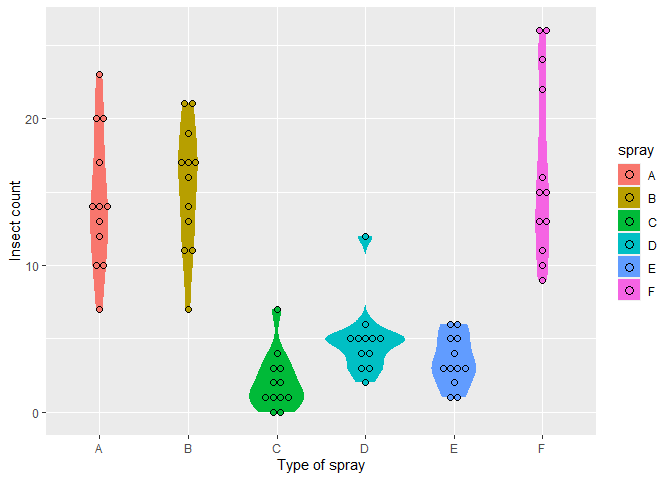
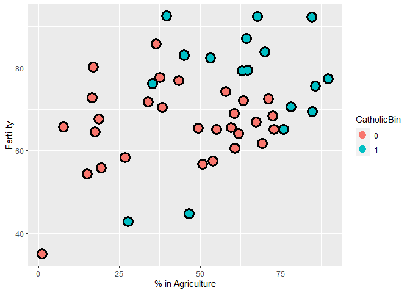
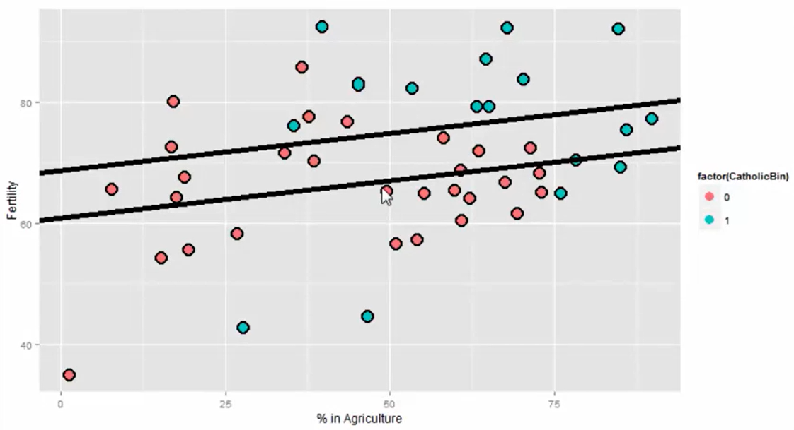
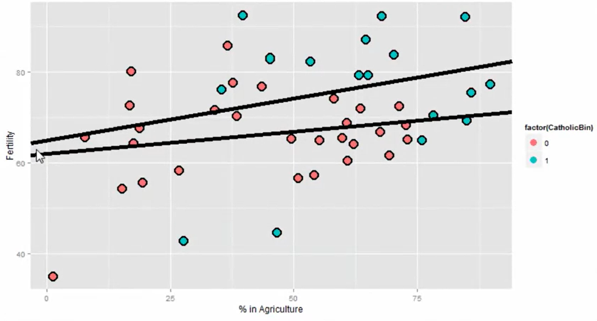
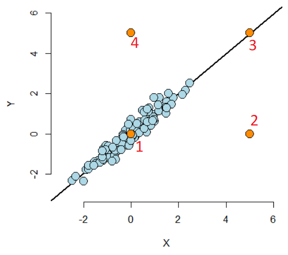
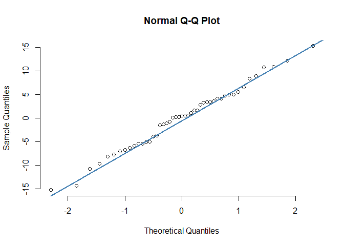

`Week 3` Regression Models
================

-   👨🏻‍💻 Author: Anderson H Uyekita
-   📚 Specialization: <a
    href="https://www.coursera.org/specializations/data-science-statistics-machine-learning"
    target="_blank" rel="noopener">Data Science: Statistics and Machine
    Learning Specialization</a>
-   📖 Course:
    <a href="https://www.coursera.org/learn/regression-models"
    target="_blank" rel="noopener">Regression Models</a>
    -   🧑‍🏫 Instructor: Brian Caffo
-   📆 Week 3
    -   🚦 Start: Tuesday, 05 July 2022
    -   🏁 Finish: Monday, 18 July 2022

------------------------------------------------------------------------

#### Assignments & Deliverables

-   [🚀 Course Project 3
    Repository](https://github.com/AndersonUyekita/regression-models_course-project-3)
-   [📝 Quiz 3](./quiz-3_regression-models.md)

#### Slides

-   Module 3 – Multivariable Regression, Residuals, & Diagnostics
    -   03_01 GLMs
    -   03_02 Binary outcomes
    -   03_03 Count outcomes
    -   03_04 Olio

#### Description

> This week, we’ll build on last week’s introduction to multivariable
> regression with some examples and then cover residuals, diagnostics,
> variance inflation, and model comparison.

------------------------------------------------------------------------

## Class Notes

#### Multivariable regression

> We now extend linear regression so that our models can contain more
> variables. A natural first approach is to assume additive effects,
> basically extending our line to a plane, or generalized version of a
> plane as we add more variables. Multivariable regression represents
> one of the most widely used and successful methods in statistics.

> The interpretation of a multivariate regression coefficient is the
> expected change in the response per unit change in the regressor,
> holding all of the other regressors fixed.

##### Example

Multivariate using `Seatbelts` dataset.

``` r
# Loading Seatbelts dataset
library(datasets)

# Creating a object.
df <- as_tibble(datasets::Seatbelts)

# Fitting the model
fit <- lm(data = df, formula = DriversKilled ~ kms + PetrolPrice)

# Printing the coefficients results.
round(summary(fit)$coeff, 4)
```

    ##              Estimate Std. Error t value Pr(>|t|)
    ## (Intercept)  215.7461    14.6656 14.7110   0.0000
    ## kms           -0.0017     0.0006 -2.8469   0.0049
    ## PetrolPrice -643.7895   148.2896 -4.3414   0.0000

All parameters have **rejected** the

hypothesis. However, it lacks interpretation because the expected number
of 215 drivers killed when the `kms` and `PetroPrice` are equal to zero
has no sense.

##### Adjusting the data

Creating a meaningful model.

``` r
# Loading Seatbelts dataset
library(datasets)

# Creating a object.
df <- as_tibble(datasets::Seatbelts)

# Centering the dataset.
df$kms_avg <- df$kms - mean(df$kms)
df$petrol_avg <- (df$PetrolPrice - mean(df$PetrolPrice))/sd(df$PetrolPrice)

# Adding new variables to the dataset.
kms_avg <- mean(df$kms)
petrol_avg <- mean(df$PetrolPrice)

# Fitting the model
fit <- lm(data = df, formula = DriversKilled ~ kms_avg + petrol_avg)

# Printing the coefficients results.
summary(fit)$coeff
```

    ##                  Estimate   Std. Error   t value      Pr(>|t|)
    ## (Intercept) 122.802083333 1.6628507162 73.850336 2.395106e-141
    ## kms_avg      -0.001749546 0.0006145401 -2.846919  4.902428e-03
    ## petrol_avg   -7.838673933 1.8055491157 -4.341435  2.304713e-05

-   The intercept of 122.8 is the estimated number of `DriversKilled`
    for the average `PetroPrice` and average `kms`;
-   The `PetroPrice` negative 7.9 means we expect less 7.9
    `DriversKilled` per **one standard deviation** change in
    `PetroPrice`, and;
-   Maintaining the other variables constant, the negative 0.017 in
    average `kms` means we expect less 0.0017 `DriversKilled` per `kms`,
    It is counter intuitive because increasing the `kms` reduces the
    drivers killed.

It is also possible to scale `kms` to analyze it in thousands.

``` r
# Loading Seatbelts dataset
library(datasets)

# Creating a object.
df <- as_tibble(datasets::Seatbelts)

# Centering the dataset.
df$kms_avg <- (df$kms - mean(df$kms))/1000
df$petrol_avg <- (df$PetrolPrice - mean(df$PetrolPrice))/sd(df$PetrolPrice)

# Adding new variables to the dataset.
kms_avg <- mean(df$kms)
petrol_avg <- mean(df$PetrolPrice)

# Fitting the model
fit <- lm(data = df, formula = DriversKilled ~ kms_avg + petrol_avg)

# Printing the coefficients results.
summary(fit)$coeff
```

    ##               Estimate Std. Error   t value      Pr(>|t|)
    ## (Intercept) 122.802083  1.6628507 73.850336 2.395106e-141
    ## kms_avg      -1.749546  0.6145401 -2.846919  4.902428e-03
    ## petrol_avg   -7.838674  1.8055491 -4.341435  2.304713e-05

-   After the scaling, we expect less 1.75 `DriversKilled` per 1000
    `kms`.

#### Multivariable regression tips and tricks

This lecture will use the `swiss` dataset from the `datasets` package.

``` r
# Loading the dataset to environment.
swiss <- datasets::swiss
```

Let’s examine this dataset a bit.

> **Description**
>
> Standardized fertility measure and socio-economic indicators for each
> of 47 French-speaking provinces of Switzerland at about 1888.
>
> **Format**
>
> A data frame with 47 observations on 6 variables, each of which is in
> percent, i.e., in \[0, 100\].
>
> \[,1\] Fertility
> ,
> ‘common standardized fertility measure’ \[,2\] Agriculture % of males
> involved in agriculture as occupation \[,3\] Examination % draftees
> receiving highest mark on army examination \[,4\] Education %
> education beyond primary school for draftees. \[,5\] Catholic %
> ‘catholic’ (as opposed to ‘protestant’). \[,6\] Infant.Mortality live
> births who live less than 1 year.
>
> All variables but ‘Fertility’ give proportions of the population.
>
> **Details**
>
> (paraphrasing Mosteller and Tukey):
>
> Switzerland, in 1888, was entering a period known as the demographic
> transition; i.e., its fertility was beginning to fall from the high
> level typical of underdeveloped countries.
>
> The data collected are for 47 French-speaking “provinces” at about
> 1888.
>
> Here, all variables are scaled to \[0, 100\], where in the original,
> all but “Catholic” were scaled to \[0, 1\].

Based on the `help()` function, we need to confirm the range of the
values. It should be 0 to 100 except for `Fertility`, which is
standardized.

``` r
# Checking the structure.
str(swiss)
```

    ## 'data.frame':    47 obs. of  6 variables:
    ##  $ Fertility       : num  80.2 83.1 92.5 85.8 76.9 76.1 83.8 92.4 82.4 82.9 ...
    ##  $ Agriculture     : num  17 45.1 39.7 36.5 43.5 35.3 70.2 67.8 53.3 45.2 ...
    ##  $ Examination     : int  15 6 5 12 17 9 16 14 12 16 ...
    ##  $ Education       : int  12 9 5 7 15 7 7 8 7 13 ...
    ##  $ Catholic        : num  9.96 84.84 93.4 33.77 5.16 ...
    ##  $ Infant.Mortality: num  22.2 22.2 20.2 20.3 20.6 26.6 23.6 24.9 21 24.4 ...

A `summary()` will give us the presence of `NA` observation and some
descriptive analysis.

``` r
# Printing the summary.
summary(swiss)
```

    ##    Fertility      Agriculture     Examination      Education    
    ##  Min.   :35.00   Min.   : 1.20   Min.   : 3.00   Min.   : 1.00  
    ##  1st Qu.:64.70   1st Qu.:35.90   1st Qu.:12.00   1st Qu.: 6.00  
    ##  Median :70.40   Median :54.10   Median :16.00   Median : 8.00  
    ##  Mean   :70.14   Mean   :50.66   Mean   :16.49   Mean   :10.98  
    ##  3rd Qu.:78.45   3rd Qu.:67.65   3rd Qu.:22.00   3rd Qu.:12.00  
    ##  Max.   :92.50   Max.   :89.70   Max.   :37.00   Max.   :53.00  
    ##     Catholic       Infant.Mortality
    ##  Min.   :  2.150   Min.   :10.80   
    ##  1st Qu.:  5.195   1st Qu.:18.15   
    ##  Median : 15.140   Median :20.00   
    ##  Mean   : 41.144   Mean   :19.94   
    ##  3rd Qu.: 93.125   3rd Qu.:21.70   
    ##  Max.   :100.000   Max.   :26.60

Finally, the `ggpairs()` create several plots to explore it visually.

``` r
# Creating a quick exploratory.
ggpairs(data = swiss, lower = list(continuous = "smooth"))
```

<!-- -->

Now, let’s create a fit model.

``` r
# creating a multivariate model WITH Intercept.
#
# The dot means = all other variables
#
fit <- lm(data = swiss, formula = Fertility ~ .)

# Printing the coefficients from summary
round(summary(fit)$coeff, 4)
```

    ##                  Estimate Std. Error t value Pr(>|t|)
    ## (Intercept)       66.9152    10.7060  6.2502   0.0000
    ## Agriculture       -0.1721     0.0703 -2.4481   0.0187
    ## Examination       -0.2580     0.2539 -1.0163   0.3155
    ## Education         -0.8709     0.1830 -4.7585   0.0000
    ## Catholic           0.1041     0.0353  2.9530   0.0052
    ## Infant.Mortality   1.0770     0.3817  2.8216   0.0073

**Obs.:** The Fertility is a standardized variable.

Table 1 shows the interpretation process.

<center>
<strong>Table 1</strong> – Variable Interpretation
</center>

|     Variable     | Manipulation | Interpretation                                                                                                                                                                            |
|:----------------:|:------------:|:------------------------------------------------------------------------------------------------------------------------------------------------------------------------------------------|
|   Agriculture    | scaled \[%\] | Our model estimates an expected 0.17 decrease in standardized fertility for every 1% increase in percentage of males involved in `Agriculture`, holding the remaining variables constant. |
|   Examination    | scaled \[%\] | Our model estimates an expected 0.25 decrease in standardized fertility for every 1% increase in percentage of males involved in `Examination`, holding the remaining variables constant. |
|    Education     | scaled \[%\] | Our model estimates an expected 0.87 decrease in standardized fertility for every 1% increase in percentage of males involved in `Education`, holding the remaining variables constant.   |
|     Catholic     | scaled \[%\] | Our model estimates an expected 0.10 increase in standardized fertility for every 1% increase in percentage of males involved in `Catholic`, holding the remaining variables constant.    |
| Infant.Mortality |     ???      | ???                                                                                                                                                                                       |

Analyzing the t-test.


Due to the
")
is 0.0187 or 1.87%, we **Reject** the

because the

is 5%.

 < 5\%")

For this reason, there is evidence `Agriculture` is a good predictor.

``` r
summary(fit)
```

    ## 
    ## Call:
    ## lm(formula = Fertility ~ ., data = swiss)
    ## 
    ## Residuals:
    ##      Min       1Q   Median       3Q      Max 
    ## -15.2743  -5.2617   0.5032   4.1198  15.3213 
    ## 
    ## Coefficients:
    ##                  Estimate Std. Error t value Pr(>|t|)    
    ## (Intercept)      66.91518   10.70604   6.250 1.91e-07 ***
    ## Agriculture      -0.17211    0.07030  -2.448  0.01873 *  
    ## Examination      -0.25801    0.25388  -1.016  0.31546    
    ## Education        -0.87094    0.18303  -4.758 2.43e-05 ***
    ## Catholic          0.10412    0.03526   2.953  0.00519 ** 
    ## Infant.Mortality  1.07705    0.38172   2.822  0.00734 ** 
    ## ---
    ## Signif. codes:  0 '***' 0.001 '**' 0.01 '*' 0.05 '.' 0.1 ' ' 1
    ## 
    ## Residual standard error: 7.165 on 41 degrees of freedom
    ## Multiple R-squared:  0.7067, Adjusted R-squared:  0.671 
    ## F-statistic: 19.76 on 5 and 41 DF,  p-value: 5.594e-10

``` r
# Calculating the p-value - AGRICULTURE
2*pt(q = -2.4481, df = 41, lower.tail = TRUE)
```

    ## [1] 0.01872904

``` r
# Calculating the p-value - EXAMINATION
2*pt(-1.0163, df = 41, lower.tail = TRUE)
```

    ## [1] 0.3154466

``` r
# Calculating the p-value - EDUCATION
2*pt(-4.7585, df = 41, lower.tail = TRUE)
```

    ## [1] 2.43054e-05

``` r
# Calculating the p-value - CATHOLIC
2*pt(2.9530, df = 41, lower.tail = FALSE)
```

    ## [1] 0.005189644

``` r
# Calculating the p-value - Infant.Mortality
2*pt(2.8216, df = 41, lower.tail = FALSE)
```

    ## [1] 0.007335114

##### Unnecessary Variable

Case one variable is a linear combination of one or more variables, the
`lm()` will eliminate the variable.

> It is only through adding variables that are not perfectly explained
> by the existing ones that one can explain more variation in the
> response.

##### Dummy Variables

> It is interesting to note that models with factor variables as
> predictors are simply special cases of regression models.

-   Three level factors: Republican, Democrat, and Independent.


As you can see, only two variables must codify those three parties.

|  |  | Explanation |
|:------------------------------------------------------------------------------------------------------------:|:------------------------------------------------------------------------------------------------------------:|:-----------:|
|                                                      1                                                       |                                                      0                                                       | Republican  |
|                                                      0                                                       |                                                      1                                                       |  Democrat   |
|                                                      0                                                       |                                                      0                                                       | Independent |

The `Independent` party could be codified as a combination of the other
variables.

> So, we can interpret our coefficients as follows:
>
> -   
>     compares the mean for Republicans to that of Independents/Others.
>     -   The mean:
>         ![E\[Y_i\] = \beta_0 + \beta_1](https://latex.codecogs.com/png.image?%5Cdpi%7B110%7D&space;%5Cbg_white&space;E%5BY_i%5D%20%3D%20%5Cbeta_0%20%2B%20%5Cbeta_1 "E[Y_i] = \beta_0 + \beta_1")
> -   
>     compares the mean for Democrats to that of Independents/Others.
>     -   The mean:
>         ![E\[Y_i\] = \beta_0 + \beta_2](https://latex.codecogs.com/png.image?%5Cdpi%7B110%7D&space;%5Cbg_white&space;E%5BY_i%5D%20%3D%20%5Cbeta_0%20%2B%20%5Cbeta_2 "E[Y_i] = \beta_0 + \beta_2")
> -   
>     compares the mean for Republicans to that of Democrats.
>     -   The mean:
>         ![E\[Y_i\] = \beta_0](https://latex.codecogs.com/png.image?%5Cdpi%7B110%7D&space;%5Cbg_white&space;E%5BY_i%5D%20%3D%20%5Cbeta_0 "E[Y_i] = \beta_0")
>
> Notice the coefficients are all comparisons to the category that we
> left out, Independents/Others.
>
> **If one category is an obvious reference category, chose that one to
> leave out.** In R, if our variable is a factor variable, it will
> create the dummy variables for us and pick one of the levels to be the
> reference level. Let’s go through an example to see.

##### Example with Intercept

``` r
# Loading InsectSprays dataset.
data(InsectSprays)
```

> **Description**
>
> The counts of insects in agricultural experimental units treated with
> different insecticides.
>
> **Format**
>
> A data frame with 72 observations on 2 variables.
>
> \[,1\] count - numeric - Insect count \[,2\] spray - factor - The type
> of spray

`spray` is a factor variable.

``` r
str(InsectSprays)
```

    ## 'data.frame':    72 obs. of  2 variables:
    ##  $ count: num  10 7 20 14 14 12 10 23 17 20 ...
    ##  $ spray: Factor w/ 6 levels "A","B","C","D",..: 1 1 1 1 1 1 1 1 1 1 ...

`spray` has 6 levels.

``` r
summary(InsectSprays)
```

    ##      count       spray 
    ##  Min.   : 0.00   A:12  
    ##  1st Qu.: 3.00   B:12  
    ##  Median : 7.00   C:12  
    ##  Mean   : 9.50   D:12  
    ##  3rd Qu.:14.25   E:12  
    ##  Max.   :26.00   F:12

Data visualization

``` r
# Plotting a graph.
g = ggplot(data = InsectSprays, aes(y = count, x = spray, fill = spray))
g = g + geom_violin(colour = "transparent")
g = g + geom_dotplot(binaxis = "y", stackdir = "center", binwidth = 0.5)
g = g + xlab("Type of spray") + ylab("Insect count")
g
```

<!-- -->

Fitting a model with dummies and Intercept.

``` r
# Fitting a multivariate model.
fit <- lm(data = InsectSprays, formula = count ~ spray)

# Printing the coefficients in summary
summary(fit)$coef
```

    ##                Estimate Std. Error    t value     Pr(>|t|)
    ## (Intercept)  14.5000000   1.132156 12.8074279 1.470512e-19
    ## sprayB        0.8333333   1.601110  0.5204724 6.044761e-01
    ## sprayC      -12.4166667   1.601110 -7.7550382 7.266893e-11
    ## sprayD       -9.5833333   1.601110 -5.9854322 9.816910e-08
    ## sprayE      -11.0000000   1.601110 -6.8702352 2.753922e-09
    ## sprayF        2.1666667   1.601110  1.3532281 1.805998e-01

The `lm()` function has used `sprayA` as the reference category (the
default, since it has the lowest alphanumeric factor level).

**Interpretation**

> -   The test in the intercept is mean of Spray A is zero?
> -   (????) The other test will be related to the Mean of Spray B is
>     equal to Mean of Spray A (????).
> -   Comparing `Spray B` to `Spray A` (as `B - A`) the compared mean is
>     0.8333.
> -   Comparing `Spray C` to `Spray A` (as `C - A`) the compared mean is
>     -12.4166.
> -   The inferential statistics: standard errors, t value and P-value
>     all correspond to those comparisons.
> -   The intercept, 14.5, is the mean for Spray A. So, its inferential
>     statistics are testing whether or not the mean for Spray A is
>     zero.
> -   As is often the case, this test isn’t terribly informative and
>     often yields extremely small statistics (since we know the spray
>     kills some bugs).
> -   The estimated mean for Spray B is its effect plus the intercept
>     (14.5 + 0.8333);
> -   The estimated mean for Spray C is 14.5 - 12.4167 (its effect plus
>     the intercept)

##### Example without Intercept

``` r
# Fitting a multivariate model.
fit <- lm(data = InsectSprays, formula = count ~ spray - 1)

# Printing the coefficients in summary
summary(fit)$coef
```

    ##         Estimate Std. Error   t value     Pr(>|t|)
    ## sprayA 14.500000   1.132156 12.807428 1.470512e-19
    ## sprayB 15.333333   1.132156 13.543487 1.001994e-20
    ## sprayC  2.083333   1.132156  1.840148 7.024334e-02
    ## sprayD  4.916667   1.132156  4.342749 4.953047e-05
    ## sprayE  3.500000   1.132156  3.091448 2.916794e-03
    ## sprayF 16.666667   1.132156 14.721181 1.573471e-22

**Interpretation**

-   14.50 is the mean for Spray A
-   15.33 is the mean for Spray B (is confirmed by the last example
    14.5 + 0.8333)
-   2.083 is the mean for Spray C
-   This is a nice trick if you want your model formulated in the terms
    of the group means, rather than the group comparisons relative to
    the reference group.
-   Also, if there are no other covariates, the estimated coefficients
    for this model are exactly the empirical means of the groups.

``` r
# Calculating the mean.
InsectSprays %>%
    group_by(spray) %>%
    summarise(avg = mean(count))
```

    ## # A tibble: 6 × 2
    ##   spray   avg
    ##   <fct> <dbl>
    ## 1 A     14.5 
    ## 2 B     15.3 
    ## 3 C      2.08
    ## 4 D      4.92
    ## 5 E      3.5 
    ## 6 F     16.7

##### Relevel the Categories

It is necessary if you want to use `Spray C` as reference.

``` r
spray2 <- relevel(InsectSprays$spray, "C")

summary(lm(count ~ spray2, data = InsectSprays))$coef
```

    ##              Estimate Std. Error  t value     Pr(>|t|)
    ## (Intercept)  2.083333   1.132156 1.840148 7.024334e-02
    ## spray2A     12.416667   1.601110 7.755038 7.266893e-11
    ## spray2B     13.250000   1.601110 8.275511 8.509776e-12
    ## spray2D      2.833333   1.601110 1.769606 8.141205e-02
    ## spray2E      1.416667   1.601110 0.884803 3.794750e-01
    ## spray2F     14.583333   1.601110 9.108266 2.794343e-13

##### Summary

> -   If we treat a variable as a factor, R includes an intercept and
>     omits the alphabetically first level of the factor.
>     -   The intercept is the estimated mean for the reference level.
>     -   The intercept t-test tests for whether or not the mean for the
>         reference level is 0.
>     -   All other t-tests are for comparisons of the other levels
>         versus the reference level.
>     -   Other group means are obtained the intercept plus their
>         coefficient.
> -   If we omit an intercept, then it includes terms for all levels of
>     the factor.
>     -   Group means are now the coefficients.
>     -   Tests are tests of whether the groups are different than zero.
> -   If we want comparisons between two levels, neither of which is the
>     reference level, we could refit the model with one of them as the
>     reference level.

#### Swiss Dataset with Dummy

This time we will analyze this dataset, adding a new categorical
variable, the so-called Dummy Variable.

For cities with Catholic, greater than 50% will be defined as 1.

``` r
# Loading the Swiss dataset.
df_swiss <- datasets::swiss

# Adding a the new variable.
df_swiss <- mutate(.data = df_swiss, CatholicBin = factor(1 * (Catholic > 50), levels = c(0,1)))
```

Let’s plot the new dataset.

``` r
g = ggplot(df_swiss, aes(x = Agriculture, y = Fertility, colour = CatholicBin))
g = g + geom_point(size = 6, colour = "black") + geom_point(size = 4)
g = g + xlab("% in Agriculture") + ylab("Fertility")
g
```

<!-- -->

Defining the fit model.


Where:

-   :
    Fertility
-   :
    Agriculture
-   :
    CatholicBin

Using R to calculate the coefficients.

``` r
# Fitting the model
fit <- lm(data = df_swiss, formula = Fertility ~ Agriculture)

# Printing the coefficients.
summary(fit)$coeff
```

    ##               Estimate Std. Error   t value     Pr(>|t|)
    ## (Intercept) 60.3043752 4.25125562 14.185074 3.216304e-18
    ## Agriculture  0.1942017 0.07671176  2.531577 1.491720e-02

Now, let’s use the new variable.

When

or `CatholicBin = 0`:


When

or `CatholicBin = 1`:

 + X_{i1} \cdot \beta_1 + \epsilon_i")

Calculating the model.

``` r
# Fitting the model - CREATE two model parallel
fit2 <- lm(data = df_swiss, formula = Fertility ~ Agriculture + CatholicBin)

# Printing the coefficients.
summary(fit2)$coeff
```

    ##                Estimate Std. Error   t value     Pr(>|t|)
    ## (Intercept)  60.8322366  4.1058630 14.815944 1.032493e-18
    ## Agriculture   0.1241776  0.0810977  1.531210 1.328763e-01
    ## CatholicBin1  7.8843292  3.7483622  2.103406 4.118221e-02

When

or `CatholicBin = 0`:

 = 60.83 + 0.12 \cdot \beta_1")

When

or `CatholicBin = 1`:

 = \Big( 60.83 + 7.788 \Big) + 0.12 \cdot \beta_1")

Figure 1 present the two lines.



The model has parallel lines because the slope is the same.

Now let’s create a new model with an interaction term. The new model
fit:


When

or `CatholicBin = 0`:


When

or `CatholicBin = 1`:

 + \underbrace{\Big( \beta_1 + \beta_3 \Big)}_{\text{The slope will change}} \cdot X_{i1} + \epsilon_i")

Calculating the model with interaction:

``` r
# Fitting the model - CREATE two model parallel
fit3 <- lm(data = df_swiss, formula = Fertility ~ Agriculture * CatholicBin)

# Printing the coefficients.
summary(fit3)$coeff
```

    ##                             Estimate  Std. Error    t value     Pr(>|t|)
    ## (Intercept)              62.04993019  4.78915566 12.9563402 1.919379e-16
    ## Agriculture               0.09611572  0.09881204  0.9727127 3.361364e-01
    ## CatholicBin1              2.85770359 10.62644275  0.2689238 7.892745e-01
    ## Agriculture:CatholicBin1  0.08913512  0.17610660  0.5061430 6.153416e-01

The number `1` in front of `CatholicBin` means the Non-Catholic dummy
has used as reference.

When

or `CatholicBin = 0`:

 = 62.05 + 0.09 \cdot \beta_1")

When

or `CatholicBin = 1`:

 = \Big( 62.049 + 2.857 \Big) + \Big( 0.096 + 0.089 \Big) \cdot \beta_1")

Figure 2 present the two lines.



> -   Thus, 2.8577 is the estimated change in the intercept of the
>     linear relationship between Agriculture and Fertility going from
>     non-Catholic majority to Catholic majority to Catholic majority
>     provinces.
> -   The interaction term, 0.08914, is the estimate change in the
>     slope.
> -   The estimated intercept in non-Catholic provinces is 62.04993
> -   The estimated intercept in Catholic provinces is 62.04993 +
>     2.85770.
> -   The estimated slope in non-Catholic majority provinces is 0.09612
> -   The estimated slope in Catholic majority provinces is 0.09612 +
>     0.08914
> -   If the factor has more than two levels, all of the main effects
>     are change in the intercepts from the reference level while all of
>     the interaction terms are changes in slope (again compared to the
>     reference level).

#### Adjustment

> Adjustment, is the idea of putting regressors into a linear model to
> investigate the role of a third variable on the relationship between
> another two. Since it is often the case that a third variable can
> distort, or confound if you will, the relationship between two others.
>
> As an example, consider looking at lung cancer rates and breath mint
> usage. For the sake of completeness, imagine if you were looking at
> forced expiratory volume (a measure of lung function) and breath mint
> usage. If you found a statistically significant regression
> relationship, it wouldn’t be wise to rush off to the newspapers with
> the headline “Breath mint usage causes shortness of breath!”, for a
> variety of reasons. First off, even if the association is sound, you
> don’t know that it’s causal. But, more importantly in this case, the
> likely culprit is smoking habits. Smoking rates are likely related to
> both breath mint usage rates and lung function. How would you defend
> your finding against the accusation that it’s just variability in
> smoking habits?
>
> If your finding held up among non-smokers and smokers analyzed
> separately, then you might have something. In other words, people
> wouldn’t even begin to believe this finding unless it held up while
> holding smoking status constant. That is the idea of adding a
> regression variable into a model as adjustment. The coefficient of
> interest is interpreted as the effect of the predictor on the
> response, holding the adjustment variable constant.
>
> In this lecture, we’ll use simulation to investigate how adding a
> regressor into a model addresses the idea of adjustment.

#### Residuals

> Recall from before that the vertical distances between the observed
> data points and the fitted regression line are called residuals. We
> can generalize this idea to the vertical distances between the
> observed data and the fitted surface in multivariable settings.

##### Outliers

> Outliers are extreme observations that are considerably different from
> the majority of the data. \* They can be caused by recording errors
> (in which case, they should be removed), or; \* They are just cases
> that cannot be explained by the model but carry important information.

[Reference](https://www.sjsu.edu/faculty/guangliang.chen/Math261a/Ch6slides-leverage-influence.pdf)

> Calling a point an outlier is vague and we need a more precise
> language to discuss points that fall outside of our cloud of data. The
> plot below is useful for understanding different sorts of outliers.



-   The lower left hand point (1) is not an outlier having neither
    leverage nor influence on our fitted model.
-   The upper left hand point (4) is an outlier in the Y direction, but
    not in the X. It will **have little impact on our fitted model**,
    since there’s lots of X points nearby to counteract its effect. This
    point is said to have **low leverage and influence**.
-   The upper right hand point (3) is outside of the range of X values
    and Y values, but conforms nicely to the regression relationship.
    This point has **little effect on the fitted model**. It has **high
    leverage**, but chooses not to exert it, and thus has **low
    influence**.
-   The lower right hand point (2) is outside of the range of X values,
    but not the Y values. However, it does not conform to the
    relationship of the remainder of the points at all. This outlier has
    **high leverage and influence**.

Definitions:

-   Leverage discusses how outside of the norm a point’s X values are
    from the cloud of other X values.
    -   A leverage point is an observation that has an unusual predictor
        value (very different from the bulk of the observations).
    -   A leverage point may have no influence if the observation lies
        close to the regression line
-   Influence is a measure of how much impact a point has on the
    regression fit. The most direct way to measure influence is fit the
    model with the point included and excluded.
    -   An influence point is an observation whose removal from the data
        set would cause a large change in the estimated reggression
        model coefficients.
    -   A point has to have at least some leverage in order to be
        influential.

##### Measuring Residual

We have used the workhorse `resid()`.

``` r
# Fitting a model.
fit <- lm(Fertility ~ . , data = datasets::swiss);

# Printing the residual.
resid(fit)
```

    ##   Courtelary     Delemont Franches-Mnt      Moutier   Neuveville   Porrentruy 
    ##    5.5847028    0.5900550    6.5817401    8.9796056   12.1975903  -14.4001100 
    ##        Broye        Glane      Gruyere       Sarine      Veveyse        Aigle 
    ##    4.1064868   10.7994372    1.0642170    3.4206889    3.4694330    5.0669814 
    ##      Aubonne     Avenches     Cossonay    Echallens     Grandson     Lausanne 
    ##    0.5032459    2.8753500   -3.6912074   -5.0866905    0.1058105    0.2011563 
    ##    La Vallee       Lavaux       Morges       Moudon        Nyone         Orbe 
    ##    3.5620395    1.6531050    3.3314260  -10.8032460   -4.9901286   -6.7341316 
    ##         Oron      Payerne Paysd'enhaut        Rolle        Vevey      Yverdon 
    ##   -1.0615158    1.6860070    0.5215233   -1.4727748   -5.4367352   -7.0265827 
    ##      Conthey    Entremont       Herens     Martigwy      Monthey   St Maurice 
    ##   -0.7594533   -7.6747768   -1.2661512   -5.8321170   -3.9086873   -8.1763181 
    ##       Sierre         Sion       Boudry La Chauxdfnd     Le Locle    Neuchatel 
    ##   15.3213097    8.3454790    4.8042844   -6.3425618    4.1331399   10.8806560 
    ##   Val de Ruz ValdeTravers V. De Geneve  Rive Droite  Rive Gauche 
    ##    5.0645917   -5.4529003    0.2023737   -9.6620893  -15.2742579

> A problem, though, is that these are defined as
> 
> i and thus **have the units of the outcome**. This isn’t great for
> comparing residual values across different analyses with different
> experiments. So, some efforts to standardize residuals have been made.
> Two of the most common are:

-   `rstandard()` - residuals divided by their standard deviations
-   `rstudent()` - residuals divided by their standard deviations, where
    the ith data point was deleted in the calculation of the standard
    deviation for the residual to follow a t distribution

``` r
# residuals divided by their standard deviations
rstandard(fit)
```

    ##   Courtelary     Delemont Franches-Mnt      Moutier   Neuveville   Porrentruy 
    ##   0.84879088   0.08791266   1.01048257   1.30627404   1.76728248  -2.24455414 
    ##        Broye        Glane      Gruyere       Sarine      Veveyse        Aigle 
    ##   0.61910220   1.62660361   0.15484014   0.50513353   0.52114256   0.73853627 
    ##      Aubonne     Avenches     Cossonay    Echallens     Grandson     Lausanne 
    ##   0.07337976   0.42533881  -0.55087494  -0.75093752   0.01530055   0.02962078 
    ##    La Vallee       Lavaux       Morges       Moudon        Nyone         Orbe 
    ##   0.61717364   0.24473875   0.48322187  -1.57426098  -0.71987918  -0.99576402 
    ##         Oron      Payerne Paysd'enhaut        Rolle        Vevey      Yverdon 
    ##  -0.15619031   0.25164581   0.08040532  -0.21418057  -0.77981096  -1.02075015 
    ##      Conthey    Entremont       Herens     Martigwy      Monthey   St Maurice 
    ##  -0.11657464  -1.12407589  -0.18713187  -0.85701000  -0.56772096  -1.19735192 
    ##       Sierre         Sion       Boudry La Chauxdfnd     Le Locle    Neuchatel 
    ##   2.30903587   1.21511029   0.69782992  -1.00632656   0.60796120   1.70341727 
    ##   Val de Ruz ValdeTravers V. De Geneve  Rive Droite  Rive Gauche 
    ##   0.73438250  -0.83641886   0.03828694  -1.51776044  -2.26717089

``` r
# residuals divided by their standard deviations, where the ith data point was deleted in the calculation of the standard deviation for the residual to follow a t distribution
rstudent(fit)
```

    ##   Courtelary     Delemont Franches-Mnt      Moutier   Neuveville   Porrentruy 
    ##   0.84584030   0.08684212   1.01074888   1.31796269   1.81614211  -2.36721827 
    ##        Broye        Glane      Gruyere       Sarine      Veveyse        Aigle 
    ##   0.61438409   1.66113713   0.15298493   0.50049516   0.51646133   0.73437530 
    ##      Aubonne     Avenches     Cossonay    Echallens     Grandson     Lausanne 
    ##   0.07248412   0.42104970  -0.54614038  -0.74687721   0.01511285   0.02925763 
    ##    La Vallee       Lavaux       Morges       Moudon        Nyone         Orbe 
    ##   0.61245225   0.24191247   0.47865752  -1.60418331  -0.71558271  -0.99565881 
    ##         Oron      Payerne Paysd'enhaut        Rolle        Vevey      Yverdon 
    ##  -0.15431971   0.24875019   0.07942498  -0.21167094  -0.77601876  -1.02128559 
    ##      Conthey    Entremont       Herens     Martigwy      Monthey   St Maurice 
    ##  -0.11516331  -1.12779737  -0.18491467  -0.85417952  -0.56297196  -1.20389559 
    ##       Sierre         Sion       Boudry La Chauxdfnd     Le Locle    Neuchatel 
    ##   2.44522679   1.22241299   0.69339739  -1.00648626   0.60322648   1.74541155 
    ##   Val de Ruz ValdeTravers V. De Geneve  Rive Droite  Rive Gauche 
    ##   0.73018972  -0.83329565   0.03781782  -1.54311369  -2.39447054

> **A common use for residuals is to diagnose normality of the errors.**
> This is often done by plotting the residual quantiles versus normal
> quantiles. This is called a residual QQ plot.

``` r
# Plotting a QQ-plot.
qqnorm(resid(fit), pch = 1, frame = FALSE)
qqline(resid(fit), col = "steelblue", lwd = 2)
```

<!-- -->

Your residuals should fall roughly on a line if plotted in a normal QQ
plot. There is of course noise and a perfect fit would not be expected
even if the model held.

##### Measuring Leverage

> Leverage is largely measured by one quantity, so called hat diagonals,
> which can be obtained in R by the function `hatvalues()`.

``` r
# Calculating the Leverage.
hatvalues(model = lm(Fertility ~ . , data = datasets::swiss))
```

    ##   Courtelary     Delemont Franches-Mnt      Moutier   Neuveville   Porrentruy 
    ##   0.15681744   0.12258494   0.17368296   0.07961648   0.07219003   0.19833238 
    ##        Broye        Glane      Gruyere       Sarine      Veveyse        Aigle 
    ##   0.14308241   0.14145774   0.07994004   0.10682273   0.13676942   0.08319314 
    ##      Aubonne     Avenches     Cossonay    Echallens     Grandson     Lausanne 
    ##   0.08392561   0.10990923   0.12551221   0.10631200   0.06853488   0.10175031 
    ##    La Vallee       Lavaux       Morges       Moudon        Nyone         Orbe 
    ##   0.35120780   0.11137547   0.07425778   0.08277061   0.06410496   0.10921430 
    ##         Oron      Payerne Paysd'enhaut        Rolle        Vevey      Yverdon 
    ##   0.10036242   0.12569646   0.18059095   0.07905125   0.05328210   0.07706245 
    ##      Conthey    Entremont       Herens     Martigwy      Monthey   St Maurice 
    ##   0.17335920   0.09204746   0.10834150   0.09800616   0.07675938   0.09177212 
    ##       Sierre         Sion       Boudry La Chauxdfnd     Le Locle    Neuchatel 
    ##   0.14246210   0.08125700   0.07683116   0.22629672   0.09981583   0.20532241 
    ##   Val de Ruz ValdeTravers V. De Geneve  Rive Droite  Rive Gauche 
    ##   0.07366702   0.17219053   0.45583631   0.21067014   0.11595449

> The hat values are necessarily between 0 and 1 with **larger values
> indicating greater (potential for) leverage**.

##### Measuring Influence

After leverage, there are quite a few ways to probe for **influence**.

-   `dffits()` - change in the predicted response when the
    
    point is deleted in fitting the model.
-   `dfbetas()` - change in individual coefficients when the
    
    point is deleted in fitting the model.
-   `cooks.distance()` - overall change in the coefficients when the
    
    point is deleted.

The `dffits()` check for influence in the fitted values

``` r
# Calculating the dffits
dffits(model = lm(Fertility ~ . , data = datasets::swiss))
```

    ##   Courtelary     Delemont Franches-Mnt      Moutier   Neuveville   Porrentruy 
    ##  0.364774736  0.032459846  0.463391992  0.387632506  0.506592693 -1.177437700 
    ##        Broye        Glane      Gruyere       Sarine      Veveyse        Aigle 
    ##  0.251051923  0.674276461  0.045094415  0.173086377  0.205574339  0.221219240 
    ##      Aubonne     Avenches     Cossonay    Echallens     Grandson     Lausanne 
    ##  0.021939401  0.147956243 -0.206904723 -0.257600909  0.004099386  0.009847104 
    ##    La Vallee       Lavaux       Morges       Moudon        Nyone         Orbe 
    ##  0.450610705  0.085643396  0.135566017 -0.481895728 -0.187280296 -0.348629127 
    ##         Oron      Payerne Paysd'enhaut        Rolle        Vevey      Yverdon 
    ## -0.051543413  0.094317835  0.037286767 -0.062015160 -0.184099483 -0.295109000 
    ##      Conthey    Entremont       Herens     Martigwy      Monthey   St Maurice 
    ## -0.052738670 -0.359091735 -0.064456913 -0.281562011 -0.162328602 -0.382689706 
    ##       Sierre         Sion       Boudry La Chauxdfnd     Le Locle    Neuchatel 
    ##  0.996648825  0.363539269  0.200036993 -0.544326851  0.200869693  0.887197970 
    ##   Val de Ruz ValdeTravers V. De Geneve  Rive Droite  Rive Gauche 
    ##  0.205915343 -0.380048089  0.034612755 -0.797205243 -0.867193395

The `dfbetas()` check for influence in the coefficients individually

``` r
dfbetas(model = lm(Fertility ~ . , data = datasets::swiss))
```

    ##                (Intercept)   Agriculture   Examination     Education
    ## Courtelary    1.469581e-01 -0.2509154450 -0.2178984138  0.0245329207
    ## Delemont      1.041454e-02 -0.0166230153 -0.0214672163  0.0063724726
    ## Franches-Mnt  2.885215e-01 -0.3488572182 -0.2180795220 -0.0785293310
    ## Moutier       2.412791e-01 -0.2796565726 -0.2116930311 -0.0544568925
    ## Neuveville    3.614049e-02  0.0330092787 -0.3033896660  0.2911351304
    ## Porrentruy    1.437889e-01  0.5734794652  0.2690539205  0.1389860848
    ## Broye        -1.710257e-01  0.0961293041  0.1566124113 -0.0691312635
    ## Glane        -4.865912e-01  0.2259152191  0.2809985609 -0.0778673402
    ## Gruyere       3.373071e-03 -0.0150661560  0.0106450979 -0.0188087040
    ## Sarine       -8.223184e-02 -0.0166747782  0.0433342851 -0.0166049288
    ## Veveyse      -1.259686e-01  0.0377635664  0.1016424946 -0.0631645082
    ## Aigle         1.847441e-02  0.1137864704  0.0605932083  0.0122775419
    ## Aubonne       6.440528e-04  0.0101690874 -0.0074123656  0.0070252931
    ## Avenches     -8.885971e-02  0.0906897134 -0.0023826329  0.0536696123
    ## Cossonay      6.078606e-02 -0.1147976188 -0.1293020065  0.0720348991
    ## Echallens     1.294521e-01 -0.1395214610 -0.1528438348  0.1028282046
    ## Grandson      2.050851e-03 -0.0023204919 -0.0013154780 -0.0009465224
    ## Lausanne     -6.832657e-05 -0.0009116277 -0.0023327024  0.0059085420
    ## La Vallee     2.876811e-01 -0.1641039163  0.1381542804 -0.1502060310
    ## Lavaux       -3.861156e-02  0.0671823515  0.0164880632  0.0171760274
    ## Morges       -1.654414e-02  0.0693111840  0.0647609139 -0.0210839843
    ## Moudon        6.629880e-02 -0.0256438432  0.1015665984  0.0485329857
    ## Nyone        -5.041107e-02 -0.0325560531 -0.0787656287  0.0433668011
    ## Orbe         -1.730503e-01  0.0064688204 -0.1078633634  0.1546746361
    ## Oron          6.908113e-03 -0.0196563088  0.0112328885 -0.0019752157
    ## Payerne      -3.636252e-02  0.0292126836 -0.0335789332  0.0322347657
    ## Paysd'enhaut  1.935700e-02 -0.0023728362 -0.0289791944  0.0115492034
    ## Rolle        -2.782115e-02 -0.0159671928  0.0161690994 -0.0142532161
    ## Vevey         2.548642e-02  0.0386752981 -0.0478185994 -0.0010982448
    ## Yverdon       4.560902e-02 -0.0173061275  0.1161376006 -0.0582426422
    ## Conthey      -2.850855e-02 -0.0026346462  0.0119212180 -0.0001239619
    ## Entremont     5.451628e-02 -0.1716357546  0.0166067377 -0.0712902355
    ## Herens       -6.536821e-03 -0.0228824182  0.0024855038 -0.0004846658
    ## Martigwy      5.832533e-02 -0.1062861039 -0.1303382382  0.0633644588
    ## Monthey      -4.380512e-02  0.0427987773  0.0123568968  0.0482537885
    ## St Maurice   -6.797102e-02 -0.0974569516  0.0151142466 -0.0569187562
    ## Sierre        4.716212e-01  0.0883170956 -0.2976644411  0.0886444048
    ## Sion          5.767622e-02  0.0388580852  0.0417255886  0.0320041909
    ## Boudry       -4.765995e-02  0.0091344872  0.1385604412 -0.0953513803
    ## La Chauxdfnd -8.443763e-02  0.3177842234 -0.3005224837  0.3994348543
    ## Le Locle      1.196299e-01 -0.1585563909 -0.0008535903 -0.0816606665
    ## Neuchatel    -5.231279e-01  0.1968529669  0.3779843228  0.2247031333
    ## Val de Ruz    1.082986e-01 -0.1072935008 -0.0959675394 -0.0265639070
    ## ValdeTravers -1.151115e-01  0.2292870179 -0.1764850910  0.2980040769
    ## V. De Geneve -3.401216e-03  0.0033670058 -0.0010243812  0.0227987492
    ## Rive Droite  -9.205308e-02 -0.1652240202  0.4720351199 -0.7262705554
    ## Rive Gauche  -7.463140e-02  0.0813258616  0.2090570612 -0.5510796497
    ##                  Catholic Infant.Mortality
    ## Courtelary   -0.140254625     0.0692409709
    ## Delemont      0.001117941     0.0048973568
    ## Franches-Mnt  0.126797129    -0.1037932284
    ## Moutier      -0.076234294    -0.0356603940
    ## Neuveville   -0.390483165     0.1358927562
    ## Porrentruy   -0.256365416    -0.6592728107
    ## Broye         0.140983937     0.1141013536
    ## Glane         0.308057700     0.4218624418
    ## Gruyere       0.034661434    -0.0019951422
    ## Sarine        0.093114990     0.0968650993
    ## Veveyse       0.118816529     0.1087599848
    ## Aigle        -0.051016279    -0.0906989502
    ## Aubonne      -0.016626037     0.0012432891
    ## Avenches     -0.085715286     0.0949559216
    ## Cossonay      0.017404559     0.0052997879
    ## Echallens     0.003251752    -0.0763149985
    ## Grandson     -0.001681300    -0.0001913597
    ## Lausanne     -0.002817766     0.0014009713
    ## La Vallee     0.127003688    -0.3731119241
    ## Lavaux       -0.041007340     0.0222234754
    ## Morges       -0.025116661    -0.0244594049
    ## Moudon        0.287674440    -0.2382737072
    ## Nyone        -0.004933017     0.1041232756
    ## Orbe          0.008231253     0.2361410282
    ## Oron          0.035213181    -0.0161435868
    ## Payerne      -0.066222096     0.0653764350
    ## Paysd'enhaut -0.027474119    -0.0062326602
    ## Rolle         0.031696857     0.0310106065
    ## Vevey        -0.003147329    -0.0427246070
    ## Yverdon       0.204943590    -0.1648843542
    ## Conthey      -0.012922218     0.0347292843
    ## Entremont    -0.102470752     0.0091397165
    ## Herens       -0.019897434     0.0185299966
    ## Martigwy     -0.182171132     0.0393524250
    ## Monthey      -0.088559056     0.0271922588
    ## St Maurice   -0.162327131     0.1535363833
    ## Sierre        0.207273874    -0.5509220022
    ## Sion          0.221843117    -0.1474227722
    ## Boudry        0.019679007     0.0224288132
    ## La Chauxdfnd -0.229155341     0.0506538702
    ## Le Locle      0.013223866    -0.0618252267
    ## Neuchatel     0.080236554     0.4003633814
    ## Val de Ruz   -0.102575797    -0.0075831413
    ## ValdeTravers -0.118884012     0.0773203558
    ## V. De Geneve  0.002299533    -0.0016580975
    ## Rive Droite   0.262468374     0.0540882252
    ## Rive Gauche  -0.091621742     0.0638683508

The `cooks.distance()` checks for influence in the coefficients as a
collective.

``` r
cooks.distance(model = lm(Fertility ~ . , data = datasets::swiss))
```

    ##   Courtelary     Delemont Franches-Mnt      Moutier   Neuveville   Porrentruy 
    ## 2.233176e-02 1.799632e-04 3.576983e-02 2.460093e-02 4.050222e-02 2.077343e-01 
    ##        Broye        Glane      Gruyere       Sarine      Veveyse        Aigle 
    ## 1.066647e-02 7.265696e-02 3.471875e-04 5.086126e-03 7.171732e-03 8.249015e-03 
    ##      Aubonne     Avenches     Cossonay    Echallens     Grandson     Lausanne 
    ## 8.221766e-05 3.723219e-03 7.259171e-03 1.118028e-02 2.870831e-06 1.656458e-05 
    ##    La Vallee       Lavaux       Morges       Moudon        Nyone         Orbe 
    ## 3.436545e-02 1.251196e-03 3.121719e-03 3.727352e-02 5.916059e-03 2.026133e-02 
    ##         Oron      Payerne Paysd'enhaut        Rolle        Vevey      Yverdon 
    ## 4.535869e-04 1.517361e-03 2.374726e-04 6.562694e-04 5.704113e-03 1.449967e-02 
    ##      Conthey    Entremont       Herens     Martigwy      Monthey   St Maurice 
    ## 4.749927e-04 2.134955e-02 7.091540e-04 1.330057e-02 4.466169e-03 2.414395e-02 
    ##       Sierre         Sion       Boudry La Chauxdfnd     Le Locle    Neuchatel 
    ## 1.476237e-01 2.176441e-02 6.754670e-03 4.936628e-02 6.830752e-03 1.249500e-01 
    ##   Val de Ruz ValdeTravers V. De Geneve  Rive Droite  Rive Gauche 
    ## 7.148244e-03 2.425355e-02 2.046583e-04 1.024707e-01 1.123648e-01

##### How do I use all of these things?

> -   Patterns in your residual plots generally indicate some poor
>     aspect of model fit.
> -   Heteroskedasticity (non constant variance).
> -   Missing model terms.
> -   Temporal patterns (plot residuals versus collection order).
> -   Residual QQ plots investigate normality of the errors.
> -   Leverage measures (hat values) can be useful for diagnosing data
>     entry errors and points that have a high potential for influence.
> -   Influence measures get to the bottom line, ‘how does deleting or
>     including this point impact a particular aspect of the model’.

#### Model selection

> These lectures represents a challenging question:
>
> “How do we chose what variables to include in a regression model?”.
>
> Sadly, no single easy answer exists and the most reasonable answer
> would be “It depends.”. These concepts bleed into ideas of machine
> learning, which is largely focused on high dimensional variable
> selection and weighting. In the following lectures we cover some of
> the basics and, most importantly, the consequences of overfitting and
> underfitting a model.

> That is, our primary concern is winding up with an interpretable
> model, with interpretable coefficients. In modeling, our interest lies
> in parsimonious, interpretable representations of the data that
> enhance our understanding of the phenomena under study.

> **Parsimony** is a core concept in model selection. The idea of
> parsimony is to keep your models as simple as possible (but no
> simpler). This builds on the idea of Occam’s razor¹⁰⁰, in that all
> else being equal simpler explanations are better than complex ones.
> Simpler models are easier to interpret and are less finicky. Complex
> models often have issues with fitting and, especially, overfitting.
> (To see a counterargument, consider Andrew Gelman’s blog.)

##### The Rumsfeldian triplet

-   `Known Knowns`: are regressors that we know we should check for
    inclusion in the model.
-   `Known Unknowns`: are regressors that we would like to include in
    the model, but don’t have.
-   `Unknown Unknowns`: are regressors that we don’t even know about
    that we should have included in the model.

##### General rules for `Known Knowns`

1.  Omitting variables results in bias in the coefficients of interest -
    unless the regressors are uncorrelated with the omitted ones.
2.  Including variables that we shouldn’t have increases standard errors
    of the regression variables.

> Simulation demonstrating variance inflation

``` r
# Defining a seed.
set.seed(2022)

# Defining the sample size to create a regression.
n <- 100

# Defining the length of the simulation
nosim <- 1000

# Creating data
x1 <- rnorm(n)

# Correlated x2
x2 <- x1/sqrt(2) + rnorm(n) /sqrt(2)

# Correlated x3
x3 <- x1 * 0.95 + rnorm(n) * sqrt(1 - 0.95^2);

# Calculating the coefficients for several simulations.
betas <- sapply(1 : nosim, function(i){
    
    # Creating random sample -> RANDOMIZATION.
    y <- x1 + rnorm(n, sd = .3)
    
    # Calculating the lm and registering beta_1
    c(coef(lm(y ~ x1))[2],
      coef(lm(y ~ x1 + x2))[2],
      coef(lm(y ~ x1 + x2 + x3))[2])
})

# Calculating the standard deviation of beta_1
round(apply(betas, 1, sd), 5)
```

    ##      x1      x1      x1 
    ## 0.03009 0.04351 0.10728

> The parsimonious model using `x1` has 0.03009 variances. Meanwhile,
> the model with `x1` and `x2` has a bit more variance (0.04351), and
> the last model has a massive variance of 0.10728. This code
> synthesizes the results of adding variables without need.

3.  R squared goes up as you put regressors in the model

> The adjusted
> 
> is better for these purposes than
> 
> since it accounts for the number of variables included in the model.

> -   The variance inflation factor (VIF) is the increase in the
>     variance for the ith regressor compared to the ideal setting where
>     it is orthogonal to the other regressors.
>     -   The square root of the VIF is the increase in the sd instead
>         of variance.
> -   Remember, variance inflation is only part of the picture. We want
>     to include certain variables, even if they dramatically inflate
>     our variance.

##### How to do nested model testing in R

``` r
# Model 1
fit1 <- lm(Fertility ~ Agriculture, data = swiss)

# Model 2
fit3 <- update(fit1, Fertility ~ Agriculture + Examination + Education)

# Model 3
fit5 <- update(fit1, Fertility ~ Agriculture + Examination + Education + Catholic + Infant.Mortality)

# Analysis of Variance Table
anova(fit1, fit3, fit5)
```

    ## Analysis of Variance Table
    ## 
    ## Model 1: Fertility ~ Agriculture
    ## Model 2: Fertility ~ Agriculture + Examination + Education
    ## Model 3: Fertility ~ Agriculture + Examination + Education + Catholic + 
    ##     Infant.Mortality
    ##   Res.Df    RSS Df Sum of Sq      F    Pr(>F)    
    ## 1     45 6283.1                                  
    ## 2     43 3180.9  2    3102.2 30.211 8.638e-09 ***
    ## 3     41 2105.0  2    1075.9 10.477 0.0002111 ***
    ## ---
    ## Signif. codes:  0 '***' 0.001 '**' 0.01 '*' 0.05 '.' 0.1 ' ' 1

**Interpretation**

> The P-values are for a test of whether all of the new variables are
> all zero or not (i.e. whether or not they’re necessary). So this model
> would conclude that all of the added Model 3 terms are necessary over
> Model 2 and all of the Model 2 terms are necessary over Model 1.
>
> So, unless there were some other compelling reasons, **we’d pick Model
> 3**.
>
> Again, you don’t want to blindly follow a model selection procedure,
> but when the models are naturally nested, this is a reasonable
> approach.
