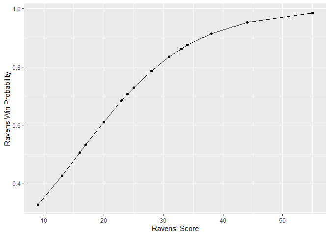
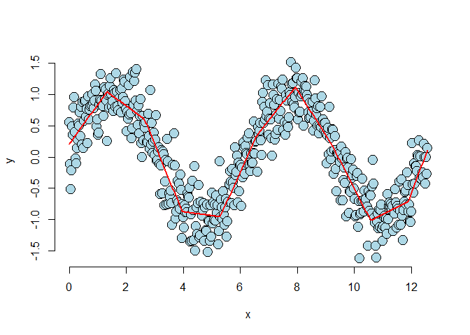
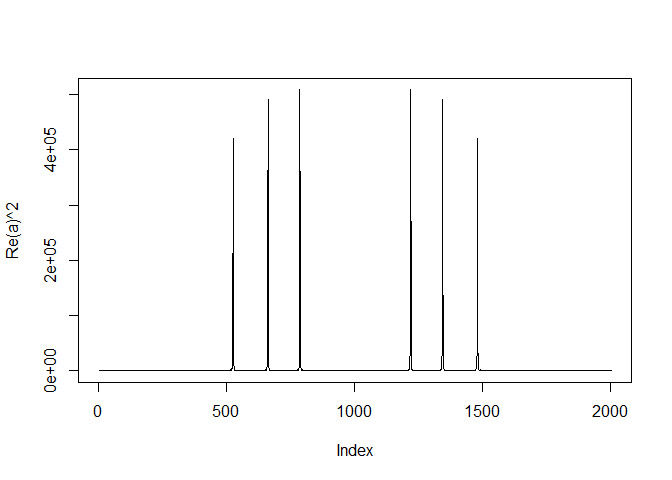

`Week 4` Regression Models
================

-   👨🏻‍💻 Author: Anderson H Uyekita
-   📚 Specialization: <a
    href="https://www.coursera.org/specializations/data-science-foundations-r"
    target="_blank" rel="noopener">Data Science: Foundations using R
    Specialization</a>
-   📖 Course:
    <a href="https://www.coursera.org/learn/regression-models"
    target="_blank" rel="noopener">Regression Models</a>
    -   🧑‍🏫 Instructor: Brian Caffo
-   📆 Week 4
    -   🚦 Start: Tuesday, 05 July 2022
    -   🏁 Finish: Sunday, 10 July 2022

------------------------------------------------------------------------

#### Assignments & Deliverables

-   [🚀 Course Project 4
    Repository](https://github.com/AndersonUyekita/regression-models_course-project-4)
-   [📝 Quiz 4](./quiz-4_regression-models.md)

#### Slides

-   Module 4 – Logistic Regression and Poisson Regression
    -   Logistic Regression
    -   Poisson Regression
    -   Hodgepodge

#### Description

> This week, we will work on generalized linear models, including binary
> outcomes and Poisson regression.

------------------------------------------------------------------------

## Class Notes

### Generalized linear models (GLMs)

> The generalized linear model is family of models that includes linear
> models. By extending the family, it handles many of the issues with
> linear models, **but at the expense of some complexity and loss of
> some of the mathematical tidiness**. A GLM involves three components
>
> -   An exponential family model for the response.
> -   A systematic component via a linear predictor.
> -   A link function that connects the means of the response to the
>     linear predictor.
>
> The three most famous cases of GLMs are:

-   linear models, binomial and
-   binary regression and Poisson regression.

> We’ll go through the GLM model specification and likelihood for all
> three. For linear models, we’ve developed them previously.
>
> The next two modules will be devoted to binomial and Poisson
> regression. We’ll only focus on the most popular and useful link
> functions.

Involves three components:

-   An exponential family model for the response.
-   A systematic component via a linear predictor.
-   A link function that connects the means of the response to the
    linear predictor.

### Logistic regression

> Binary GLMs come from trying to model outcomes **that can take only
> two values**.
>
> Some examples include: survival or not
>
> At the end of a study, winning versus losing of a team and success
> versus failure of a treatment or product. Often these outcomes are
> called Bernoulli outcomes, from the Bernoulli distribution named after
> the famous probabilist and mathematician.
>
> If we happen to have several exchangeable binary outcomes for the same
> level of covariate values, then that is binomial data and we can
> aggregate the 0’s and 1’s into the count of 1’s. As an example,
> imagine if we sprayed insect pests with 4 different pesticides and
> counted whether they died or not. Then for each spray, we could
> summarize the data with the count of dead and total number that were
> sprayed and treat the data as binomial rather than Bernoulli.

**Key Ideas**

-   Frequently we care about outcomes that have two values
    -   Alive/dead
    -   Win/loss
    -   Success/Failure
-   Called binary, Bernoulli or 0/1 outcomes
-   Collection of exchangeable binary outcomes for the same covariate
    data are called binomial outcomes.

Loading data from [Baltimore Ravens](https://www.baltimoreravens.com).

``` r
# Loading Raven Data
load(file = "./data/ravensData.rda")

# Printing the structure
str(ravensData)
```

    ## 'data.frame':    20 obs. of  4 variables:
    ##  $ ravenWinNum  : num  1 1 1 1 1 0 1 1 1 1 ...
    ##  $ ravenWin     : Factor w/ 2 levels "L","W": 2 2 2 2 2 1 2 2 2 2 ...
    ##  $ ravenScore   : num  24 38 28 34 44 23 31 23 9 31 ...
    ##  $ opponentScore: num  9 35 13 31 13 24 30 16 6 29 ...

``` r
# Printing the head of the data.
head(ravensData)
```

    ##   ravenWinNum ravenWin ravenScore opponentScore
    ## 1           1        W         24             9
    ## 2           1        W         38            35
    ## 3           1        W         28            13
    ## 4           1        W         34            31
    ## 5           1        W         44            13
    ## 6           0        L         23            24

Modeling a simple Linear Regression

``` r
fit <- lm(data = ravensData, formula = ravenWinNum ~ ravenScore)

summary(fit)$coeff %>% round(4)
```

    ##             Estimate Std. Error t value Pr(>|t|)
    ## (Intercept)   0.2850     0.2566  1.1106   0.2814
    ## ravenScore    0.0159     0.0091  1.7551   0.0963

**Model**


**Interpretation**

-   The probability would exceed 100% if Ravens scored 63 points.
    -   Sixty three is an unusual, but not impossible, score in American
        football, but the principle applies broadly: modeling binary
        data with linear models results in models that fail the basic
        assumption of the data.

Let’s use the `GLM` function.

``` r
fit <- glm(data = ravensData, formula = ravenWinNum ~ ravenScore, family = "binomial")

summary(fit)
```

    ## 
    ## Call:
    ## glm(formula = ravenWinNum ~ ravenScore, family = "binomial", 
    ##     data = ravensData)
    ## 
    ## Deviance Residuals: 
    ##     Min       1Q   Median       3Q      Max  
    ## -1.7575  -1.0999   0.5305   0.8060   1.4947  
    ## 
    ## Coefficients:
    ##             Estimate Std. Error z value Pr(>|z|)
    ## (Intercept) -1.68001    1.55412  -1.081     0.28
    ## ravenScore   0.10658    0.06674   1.597     0.11
    ## 
    ## (Dispersion parameter for binomial family taken to be 1)
    ## 
    ##     Null deviance: 24.435  on 19  degrees of freedom
    ## Residual deviance: 20.895  on 18  degrees of freedom
    ## AIC: 24.895
    ## 
    ## Number of Fisher Scoring iterations: 5

Creating a plot to help us.

``` r
# Creating the dataset to be used in ggplot2.
df_raves <- data.frame("score" = ravensData$ravenScore, "fitted" = fit$fitted.values)

# Plotting.
ggplot(data = df_raves, aes(x = score, y = fitted)) + 
    geom_point() + 
    geom_line() + 
    xlab(label = "Ravens' Score") + 
    ylab(label = "Ravens Win Probability")
```

<!-- -->

To interpret our coefficients, let’s exponentiate them.

``` r
exp(fit$coeff)
```

    ## (Intercept)  ravenScore 
    ##   0.1863724   1.1124694

**Interpretation**

> -   The first line of code shows that the exponentiated slope
>     coefficient is 1.11.
>     -   Thus, we estimate a 11% increase in the odds of winning per 1
>         point increase in score

Calculating the Confidence Interval.

``` r
exp(confint(fit))
```

    ##                   2.5 %   97.5 %
    ## (Intercept) 0.005674966 3.106384
    ## ravenScore  0.996229662 1.303304

> The confident interval goes from 0.99 to 1.303. Since this interval
> contains 1 (or contains 0 on the log scale), it’s not statistically
> significant. (It’s pretty close, though.)

**Summary**

-   Odds aren’t probabilities.
-   In binary GLMs, we model the log of the odds (logit) and our slope
    parameters are interpreted as log odds ratios.
-   Odds ratios of 1 or log odds ratios of 0 are interpreted as no
    effect of the regressor on the outcome.

### Poisson Regression

> Many data take the form of unbounded count data. For example, consider
> the number of calls to a call center or the number of flu cases in an
> area or the number of hits to a web site.
>
> In some cases the counts are clearly bounded. However, modeling the
> counts as unbounded is often done when the upper limit is not known or
> very large relative to the number of events.
>
> If the upper bound is known, the techniques we’re discussing can be
> used to model the proportion or rate. The starting point for most
> count analysis is the the Poisson distribution.
>
> In the following lectures, we go over some of the basics of modeling
> count data.

**Key ideas**

-   Many data take the form of counts
    -   Calls to a call center
    -   Number of flu cases in an area
    -   Number of cars that cross a bridge
-   Data may also be in the form of rates
    -   Percent of children passing a test
    -   Percent of hits to a website from a country
-   Linear regression with transformation is an option

**Poisson distribution**

-   The Poisson distribution is a useful model for counts and rates
-   Here a rate is count per some monitoring time
-   Some examples uses of the Poisson distribution
    -   Modeling web traffic hits
    -   Incidence rates
    -   Approximating binomial probabilities with small p and large n
    -   Analyzing contingency table data

The Poisson distribution is the goto distribution for modeling counts
and rates.

**Poisson regression**

> Poisson regression is similar to logging the outcome. However, instead
> we log the model mean exactly as in the binary chapter where we logged
> the modeled odds. **This takes care of the problem of zero counts
> elegantly.**

### Mishmash

> This lecture is a bit of an mishmash of interesting things that one
> can accomplish with linear models.

-   We’re going to cover a basic technique called **regression
    splines**.

``` r
## simulate the data using sin() base.
n <- 500
x <- seq(0, 4 * pi, length = n)
y <- sin(x) + rnorm(n, sd = .3)

## the break points of the spline fit
knots <- seq(0, 8 * pi, length = 20)

## building the regression spline terms
splineTerms <- sapply(knots, function(knot) (x > knot) * (x - knot))

## adding an intercept and the linear term
xMat <- cbind(1, x, splineTerms)

## fit the model, notice the intercept is in xMat so we have -1
yhat <- predict(lm(y ~ xMat - 1))

## perform the plot
plot(x, y, frame = FALSE, pch = 21, bg = "lightblue", cex = 2)
lines(x, yhat, col = "red", lwd = 2)
```

<!-- -->

**Harmonics using linear models**

``` r
## Chord finder, playing the white keys on a piano from octave c4 - c5
## Note frequencies in the order of C4, D4, E4, F4, G4, A4, B4, C5
notes4 <- c(261.63, 293.66, 329.63, 349.23, 392.00, 440.00, 493.88, 523.25)
## The time variable (how long the chord is played and how frequently it is digitall y sampled)
t <- seq(0, 2, by = .001); n <- length(t)
## The notes for a C Major Chord
c4 <- sin(2 * pi * notes4[1] * t); e4 <- sin(2 * pi * notes4[3] * t);
g4 <- sin(2 * pi * notes4[5] * t)
## Create the chord by adding the three together
chord <- c4 + e4 + g4 + rnorm(n, 0, 0.3)
```

It is interesting to note that what we’re accomplishing is highly
related to the famous Discrete Fourier Transform. This is an automatic
what to fit all sine and cosine terms available to a set of data. And,
the Fast (Discrete) Fourier Transform (FFT) does it about as fast as
possible (faster than fitting the linear model). Here, I give some code
to show taking the FFT and plotting the coefficients. Notice it lodes on
the three notes comprising the chords.

``` r
##(How you would really do it)
a <- fft(chord)

plot(Re(a)^2, type = "l")
```

<!-- -->
