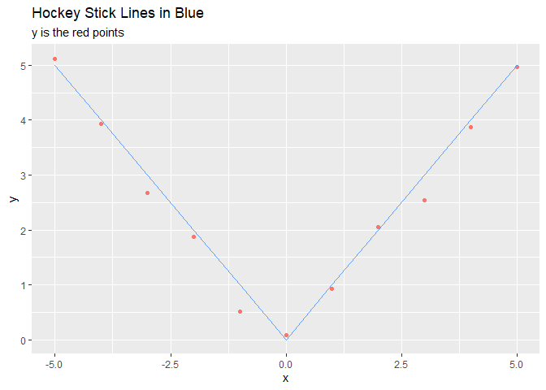

`Quiz 4` Regression Models
================

-   👨🏻‍💻 Author: Anderson H Uyekita
-   📚 Specialization: <a
    href="https://www.coursera.org/specializations/data-science-statistics-machine-learning"
    target="_blank" rel="noopener">Data Science: Statistics and Machine
    Learning Specialization</a>
-   📖 Course:
    <a href="https://www.coursera.org/learn/regression-models"
    target="_blank" rel="noopener">Regression Models</a>
    -   🧑‍🏫 Instructor: Brian Caffo
-   📆 Week 4
    -   🚦 Start: Tuesday, 05 July 2022
    -   🏁 Finish: Tuesday, 19 July 2022
-   🌎 Rpubs: [Interactive
    Document](https://rpubs.com/AndersonUyekita/quiz-4_regression-models)

------------------------------------------------------------------------

## Question 1

Consider the space shuttle data `?shuttle` in the

library. Consider modeling the use of the autolander as the outcome
(variable name **use**). Fit a logistic regression model with autolander
(variable auto) use (labeled as “auto” 1) versus not (0) as predicted by
wind sign (variable **wind**). Give the estimated odds ratio for
autolander use comparing head winds, labeled as “head” in the variable
headwind (numerator) to tail winds (denominator).

-   [ ] 1.327
-   [ ] 0.031
-   [x] 0.969
-   [ ] -0.031

**Answer**

``` r
# Loading MASS package to use shuttle dataset.
library(MASS)

# Exploring
str(MASS::shuttle)
```

    ## 'data.frame':    256 obs. of  7 variables:
    ##  $ stability: Factor w/ 2 levels "stab","xstab": 2 2 2 2 2 2 2 2 2 2 ...
    ##  $ error    : Factor w/ 4 levels "LX","MM","SS",..: 1 1 1 1 1 1 1 1 1 1 ...
    ##  $ sign     : Factor w/ 2 levels "nn","pp": 2 2 2 2 2 2 1 1 1 1 ...
    ##  $ wind     : Factor w/ 2 levels "head","tail": 1 1 1 2 2 2 1 1 1 2 ...
    ##  $ magn     : Factor w/ 4 levels "Light","Medium",..: 1 2 4 1 2 4 1 2 4 1 ...
    ##  $ vis      : Factor w/ 2 levels "no","yes": 1 1 1 1 1 1 1 1 1 1 ...
    ##  $ use      : Factor w/ 2 levels "auto","noauto": 1 1 1 1 1 1 1 1 1 1 ...

``` r
# Subsetting the dataset.
MASS::shuttle %>%
    
    # Selecting only use and wind variables.
    dplyr::select(use, wind) %>%
    
    # Releveling the factors following the instructions.
    mutate(use = factor(recode(use, noauto = 0, auto = 1)),
           wind = factor(recode(wind, tail = 0, head = 1))) -> df_q1

# Fitting a Logistic Regression
fit_q1 <- glm(data = df_q1, formula = use ~ wind, family = "binomial")

# Printing the coefficients.
exp(coef(fit_q1))
```

    ## (Intercept)       wind1 
    ##   1.3272727   0.9686888

## Question 2

Consider the previous problem. Give the estimated odds ratio for
autolander use comparing head winds (numerator) to tail winds
(denominator) adjusting for wind strength from the variable magn.

-   [ ] 1.00
-   [x] 0.969
-   [ ] 0.684
-   [ ] 1.485

**Answer**

``` r
# Loading MASS package to use shuttle dataset.
library(MASS)

# Exploring
str(MASS::shuttle);
```

    ## 'data.frame':    256 obs. of  7 variables:
    ##  $ stability: Factor w/ 2 levels "stab","xstab": 2 2 2 2 2 2 2 2 2 2 ...
    ##  $ error    : Factor w/ 4 levels "LX","MM","SS",..: 1 1 1 1 1 1 1 1 1 1 ...
    ##  $ sign     : Factor w/ 2 levels "nn","pp": 2 2 2 2 2 2 1 1 1 1 ...
    ##  $ wind     : Factor w/ 2 levels "head","tail": 1 1 1 2 2 2 1 1 1 2 ...
    ##  $ magn     : Factor w/ 4 levels "Light","Medium",..: 1 2 4 1 2 4 1 2 4 1 ...
    ##  $ vis      : Factor w/ 2 levels "no","yes": 1 1 1 1 1 1 1 1 1 1 ...
    ##  $ use      : Factor w/ 2 levels "auto","noauto": 1 1 1 1 1 1 1 1 1 1 ...

``` r
# Subsetting the dataset.
MASS::shuttle %>%
    
    # Selecting only use and wind variables.
    dplyr::select(use, wind, magn) %>%
    
    # Releveling the factors following the instructions.
    mutate(use = factor(recode(use, noauto = 0, auto = 1)),
           wind = factor(recode(wind, tail = 0, head = 1))) -> df_q2

# Fitting a Logistic Regression
fit_q2 <- glm(data = df_q2, formula = use ~ wind + magn, family = "binomial")

# Printing the summary
summary(fit_q2)$coeff;
```

    ##                  Estimate Std. Error       z value  Pr(>|z|)
    ## (Intercept)  3.955180e-01  0.2843987  1.390717e+00 0.1643114
    ## wind1       -3.200873e-02  0.2530225 -1.265055e-01 0.8993318
    ## magnMedium   6.838721e-16  0.3599481  1.899918e-15 1.0000000
    ## magnOut     -3.795136e-01  0.3567709 -1.063746e+00 0.2874438
    ## magnStrong  -6.441258e-02  0.3589560 -1.794442e-01 0.8575889

``` r
# Printing the coefficients.
exp(coef(fit_q2))
```

    ## (Intercept)       wind1  magnMedium     magnOut  magnStrong 
    ##   1.4851533   0.9684981   1.0000000   0.6841941   0.9376181

## Question 3

If you fit a logistic regression model to a binary variable, for example
use of the autolander, then fit a logistic regression model for one
minus the outcome (not using the autolander) what happens to the
coefficients?

-   [x] The coefficients reverse their signs.
-   [ ] The intercept changes sign, but the other coefficients don’t.
-   [ ] The coefficients change in a non-linear fashion.
-   [ ] The coefficients get inverted (one over their previous value).

**Answer**

``` r
# Loading MASS package to use shuttle dataset.
library(MASS)

# Exploring
str(MASS::shuttle);
```

    ## 'data.frame':    256 obs. of  7 variables:
    ##  $ stability: Factor w/ 2 levels "stab","xstab": 2 2 2 2 2 2 2 2 2 2 ...
    ##  $ error    : Factor w/ 4 levels "LX","MM","SS",..: 1 1 1 1 1 1 1 1 1 1 ...
    ##  $ sign     : Factor w/ 2 levels "nn","pp": 2 2 2 2 2 2 1 1 1 1 ...
    ##  $ wind     : Factor w/ 2 levels "head","tail": 1 1 1 2 2 2 1 1 1 2 ...
    ##  $ magn     : Factor w/ 4 levels "Light","Medium",..: 1 2 4 1 2 4 1 2 4 1 ...
    ##  $ vis      : Factor w/ 2 levels "no","yes": 1 1 1 1 1 1 1 1 1 1 ...
    ##  $ use      : Factor w/ 2 levels "auto","noauto": 1 1 1 1 1 1 1 1 1 1 ...

``` r
# Subsetting the dataset.
MASS::shuttle %>%
    
    # Selecting only use and wind variables.
    dplyr::select(use, wind) %>%
    
    # Releveling the factors following the instructions.
    mutate(use = factor(recode(use, noauto = 1, auto = 0)),
           wind = factor(recode(wind, tail = 0, head = 1))) -> df_q3

# Fitting a Logistic Regression
fit_q3_a <- glm(data = df_q3, formula = use ~ wind, family = "binomial")
fit_q3_b <- glm(data = df_q1, formula = use ~ wind, family = "binomial")

# Printing the coefficients.
coef(fit_q3_a);coef(fit_q3_b)
```

    ## (Intercept)       wind1 
    ## -0.28312626  0.03181183

    ## (Intercept)       wind1 
    ##  0.28312626 -0.03181183

The expression

converts 0 into 1 and 1 into 0. So I have changed the recode function to
`wind` variable. Following the instructions, I have changed the wind
(not the autolander).

## Question 4

Consider the insect spray data
.
Fit a Poisson model using spray as a factor level. Report the estimated
relative rate comapring spray A (numerator) to spray B (denominator).

-   [ ] -0.056
-   [ ] 0.321
-   [x] 0.9457
-   [ ] 0.136

**Answer**

``` r
# Exploring Insect Spray dataset.
str(InsectSprays)
```

    ## 'data.frame':    72 obs. of  2 variables:
    ##  $ count: num  10 7 20 14 14 12 10 23 17 20 ...
    ##  $ spray: Factor w/ 6 levels "A","B","C","D",..: 1 1 1 1 1 1 1 1 1 1 ...

``` r
# Releveling the spray variable.
df_q4 <- InsectSprays %>%
    mutate(spray = fct_relevel(spray, c("B", "A", "C", "D", "E", "F")))

# Fitting the model.
fit_q4 <- glm(data = df_q4, formula = count ~ spray, family = "poisson")

# Printing the coefficients.
exp(coef(fit_q4))
```

    ## (Intercept)      sprayA      sprayC      sprayD      sprayE      sprayF 
    ##  15.3333333   0.9456522   0.1358696   0.3206522   0.2282609   1.0869565

The spray B is the baseline, so every spray coefficient is based on it.
For this reason, the relative rate comparison between A and B is
0.9456522.

## Question 5

Consider a Poisson glm with an offset,
.
So, for example, a model of the form
, family = poisson)")
where

is a factor variable comparing a treatment (1) to a control (0) and

is the natural log of a monitoring time. What is impact of the
coefficient for

if we fit the model
, family = poisson)")
where
 + t")?
In other words, what happens to the coefficients if we change the units
of the offset variable.

*(Note, adding log(10) on the log scale is multiplying by 10 on the
original scale.)*

-   [ ] The coefficient is subtracted by log(10).
-   [ ] The coefficient estimate is divided by 10.
-   [x] The coefficient estimate is unchanged
-   [ ] The coefficient estimate is multiplied by 10.

**Answer**

``` r
# Selecting a dataset with treatment and control groups.
df_q5 <- datasets::PlantGrowth %>%
    filter(group %in% c("ctrl", "trt1"))

# Fitting the model - "t"
fit_q5_1 <- glm(data = df_q5, formula = weight ~ group, family = poisson, offset = log(weight))

# Fitting the model - "t2"
fit_q5_2 <- glm(data = df_q5, formula = weight ~ group, family = poisson, offset = log(weight) + log(10))

# Comparing the results.
coef(fit_q5_1);coef(fit_q5_2)
```

    ##  (Intercept)    grouptrt1 
    ## 1.409093e-16 2.144211e-16

    ##   (Intercept)     grouptrt1 
    ## -2.302585e+00  2.224558e-16

The slope is unchanged.

## Question 6

Consider the data

``` r
x <- -5:5
y <- c(5.12, 3.93, 2.67, 1.87, 0.52, 0.08, 0.93, 2.05, 2.54, 3.87, 4.97)
```

Using a knot point at 0, fit a linear model that looks like a hockey
stick with two lines meeting at x=0. Include an intercept term, x and
the knot point term. What is the estimated slope of the line after 0?

-   [ ] -1.024
-   [x] 1.013
-   [ ] -0.183
-   [ ] 2.037

**Answer**

``` r
# Creating the hockey stick with lines meeting in x = 0
stick <- abs(-5:5)

# Creating the data frame.
df_q6 <- data.frame(stick, x, y)


# Fitting a linear model.
fit_q6 <- lm(data = df_q6, formula = y ~ x + stick)

# Printing the coefficients.
summary(fit_q6)$coeff
```

    ##                 Estimate Std. Error    t value     Pr(>|t|)
    ## (Intercept) -0.182580645 0.13557812 -1.3466823 2.149877e-01
    ## x           -0.005545455 0.02170090 -0.2555403 8.047533e-01
    ## stick        1.018612903 0.04287356 23.7585306 1.048711e-08


stick = 0


stick = 1 (after the x = ZERO)


Printing the value in a ggplot2.

``` r
ggplot(data = df_q6, aes(x = x, y = y)) + 
    geom_point(color = "#F8766D") + 
    geom_line(aes(x = x, y = stick), color = "#619CFF") + 
    ggtitle(label = "Hockey Stick Lines in Blue", subtitle = "y is the red points")
```

<!-- -->
